# Diabetes Prediction Web Application

## 📋 Project Overview

**Diabetes Prediction Web Application** is an AI-powered diagnostic tool that leverages deep learning models to predict the likelihood of diabetes mellitus. The application provides three distinct predictive models based on different data types: symptoms, laboratory measurements, and lifestyle factors. Built with a Flask backend and modern web technologies, it offers an accessible, user-friendly interface for early diabetes risk assessment.


## 🎯 Key Features

### 🔍 **Multi-Model Prediction System**
- **Symptoms-Based Model**: Uses observable clinical symptoms (polyuria, polydipsia, weight loss, etc.)
- **Laboratory Measurements Model**: Based on Pima Indian Diabetes Dataset (glucose, insulin, BMI, etc.)
- **Lifestyle Factors Model**: Considers risk factors (smoking, hypertension, heart disease, etc.)

### 🌐 **Web Application Features**
- **Bilingual Interface**: Full support for English and Arabic
- **Interactive Forms**: User-friendly input interfaces for all three models
- **Visual Analytics**: Comprehensive data visualizations and correlation matrices
- **Detailed Reporting**: Individualized risk assessment reports
- **Responsive Design**: Accessible on desktop and mobile devices

### 📊 **Technical Capabilities**
- **High Accuracy Models**: Up to 97.35% accuracy on lifestyle factors model
- **Real-time Predictions**: Instant results with confidence scores
- **Data Visualization**: Interactive plots and statistical analyses
- **Model Comparison**: Side-by-side performance evaluation

## 🏗️ System Architecture

### **Technology Stack**
```
Frontend:
├── HTML5/CSS3
├── JavaScript (Chart.js, Plotly)
├── Bootstrap 5
└── Jinja2 Templating

Backend:
├── Flask (Python Web Framework)
├── TensorFlow/Keras (Deep Learning)
├── Scikit-learn (Machine Learning)
└── Pandas/NumPy (Data Processing)

Development Tools:
├── Jupyter Notebook
├── VS Code/PyCharm
├── Git/GitHub
└── PlantUML (Diagram Generation)
```

### **File Structure**
```
diabetespredictionapp/
├── app/
│   ├── models/              # Trained ML models
│   ├── static/              # CSS, JS, images
│   ├── templates/           # HTML templates
│   ├── data/                # Datasets
│   └── routes.py            # Flask routes
├── notebooks/               # Jupyter notebooks for model development
├── requirements.txt         # Python dependencies
├── run.py                   # Application entry point
└── README.md               # This file
```

## 📈 Model Performance

### **Comparative Results**

| Model Type | Accuracy | Precision | Recall | F1-Score | AUC-ROC |
|------------|----------|-----------|---------|----------|---------|
| Symptoms-Based | 91.53% | 0.92 | 0.91 | 0.915 | 0.93 |
| Laboratory Measurements | 79.27% | 0.85 | 0.84 | 0.80 | 0.79 |
| Lifestyle Factors | **97.35%** | **1.00** | **0.69** | **0.82** | **0.85** |

### **Key Insights**
- **Lifestyle Factors Model** showed superior performance with 97.35% accuracy
- **Symptoms Model** provides good balance for non-invasive screening
- **Laboratory Model** offers reliable predictions when clinical data is available

## 🚀 Installation & Setup

### **Prerequisites**
- Python 3.8 or higher
- 4GB RAM minimum (8GB recommended)
- 2GB free disk space

### **Step-by-Step Installation**

1. **Clone the Repository**
```bash
git clone https://github.com/ashrafaliqhtan/Diabetespredictionapp.git
cd Diabetespredictionapp
```

2. **Create Virtual Environment**
```bash
python -m venv venv
source venv/bin/activate  # On Windows: venv\Scripts\activate
```

3. **Install Dependencies**
```bash
pip install -r requirements.txt
```

4. **Run the Application**
```bash
python run.py
```

5. **Access the Application**
Open your browser and navigate to: `http://localhost:5000`

## 🧪 Using the Application

### **Prediction Workflow**
1. **Select Prediction Type**: Choose from Symptoms, Laboratory, or Lifestyle models
2. **Input Data**: Fill in the required fields in the intuitive forms
3. **Get Results**: View instant predictions with confidence scores
4. **Review Reports**: Access detailed analysis and visualizations
5. **Compare Models**: Evaluate different risk factors and their impact

### **Input Requirements**

#### **Symptoms Model**
- Age, Gender
- Clinical symptoms (Polyuria, Polydipsia, Weight Loss, etc.)
- Obesity status

#### **Laboratory Model**
- Pregnancies count
- Glucose level
- Blood Pressure
- Skin Thickness
- Insulin level
- BMI
- Diabetes Pedigree Function
- Age

#### **Lifestyle Model**
- Demographic information
- Medical history (Hypertension, Heart Disease)
- Smoking history
- BMI, HbA1c level
- Blood glucose level

## 🔬 Technical Methodology

### **Data Processing Pipeline**
1. **Data Collection**: Multi-source aggregation from hospitals, surveys, and public datasets
2. **Preprocessing**: Handling missing values, normalization, feature engineering
3. **Exploratory Analysis**: Statistical analysis and pattern discovery
4. **Model Training**: Deep Neural Networks with hyperparameter optimization
5. **Validation**: Cross-validation and performance metric evaluation

### **Model Architectures**
- **Deep Neural Networks** with multiple hidden layers
- **Dropout Regularization** to prevent overfitting
- **Early Stopping** for optimal training epochs
- **Adam Optimizer** for efficient gradient descent

## 📊 Data Analysis & Visualization

### **Symptoms Model Data Analysis**

<span id="_Toc142163413" class="anchor"></span>**Abstract :**

Diabetes mellitus, a prevalent chronic metabolic disorder, requires accurate diagnosis and management to prevent complications and enhance patient outcomes Current diagnostic methods are rare accessible and inefficient, highlighting the need for alternative solutions. This study aims to provide an advanced deep learning-based framework for improving early identification of at-risk individuals, facilitating intervention and prevention strategies We provide Three models were developed by Deep Neural Networks (DNN): trait-based model relying on observable traits, Pima Indian -Laboratory measurement model using data such as insulin and glucose levels from the database in use, and a cause and effect model examining the risk factors for diabetes. In addition, we developed a Python- and Flask-based web application to capture these samples, allowing users to monitor their diabetes risk. The system's use of non-invasive measurements and anthropogenic indicators enhances accessibility and cost-effectiveness, particularly by identifying at-risk individuals rapidly and accurately for underserved and resource-poor populations The system's diagnostic capabilities support personalized treatment planning and monitoring, optimizing disease management . This research could significantly improve the diagnosis and management of diabetes, with significant benefits for health care providers and patients**.

# List of Contents

[Abstract <span dir="rtl"></span>[I](#_Toc142163413)](#_Toc142163413)

[<span dir="rtl">الملخص</span>
<span dir="rtl"></span>[I](#_Toc142163413)](#_Toc142163413)

[ACKNOWLEDGEMENTS
<span dir="rtl"></span>[III](#acknowledgements)](#acknowledgements)

[DEDICATION <span dir="rtl"></span>[IV](#dedication)](#dedication)

[List of Contents **V**](#list-of-tables)

List of Tables
[<span dir="rtl"></span>[IX](#list-of-figures)](#list-of-figures)

List of Figures
[**I<span dir="rtl"></span>**[XI](#_Toc142163419)](#_Toc142163419)

[Chapter 1**:** Introduction **1**](#_Toc142163420)

> [1.1 Introduction 2](#_Toc142163421)
>
> [1.2 problem Statement
> <span dir="rtl"></span>[2](#_Toc142163422)](#_Toc142163422)
>
> [1.3 Project Aim 3](#_Toc142163423)
>
> [1.4 Project Objectives 3](#_Toc142163424)
>
> [1.5 Project Scope 3](#_Toc142163425)
>
> [1.6 Project Motivation 4](#_Toc142163426)
>
> [1.7 Project Methodology 4](#_Toc142163427)
>
> [1.8 Organization of Research 4](#_Toc142163428)

[Chapter 2: Literature Review **5**](#_Hlk170163580)

> [2.1 Introduction 6](#_Toc142163428)
>
> [2.2 Advantages and Disadvantages 6](#_Toc142163428)
>
> [2.2.1 Advantages 6](#_Toc142163433)
>
> [2.2.2 Disadvantages 6](#_Toc142163433)
>
> [2.3 Related Works 7](#_Toc142163428)

[Chapter 3: Methodology **10**](#_Hlk170163580)

> [3.1 Introduction 11](#_Toc142163433)
>
> [3.2 Symptoms Model 11](#_Toc142163433)
>
> [3.2.1 Data Collection 11](#_Toc142163433)
>
> [3.2.1.1 Field Visits to Hospitals 11](#_Toc142163433)
>
> [3.2.1.2 Surveys 11](#_Toc142163433)
>
> [3.2.1.3 Social Media Outreach 14](#_Toc142163433)
>
> [3.2.2 Model Development 14](#_Toc142163433)
>
> [3.2.2.1 Data Preprocessing 14](#_Toc142163433)
>
> [3.2.2.2 Insights and Findings
> 15](file:///C:\Users\COMPAQ%20HOUSE\Desktop\التوثيق\ducoment2-3.docx#_Toc142163433)
>
> [3.2.2.3 Data Normalization
> 17](file:///C:\Users\COMPAQ%20HOUSE\Desktop\التوثيق\ducoment2-3.docx#_Toc142163433)
>
> [3.2.2.4 Data Cleaning and Preparation
> 17](file:///C:\Users\COMPAQ%20HOUSE\Desktop\التوثيق\ducoment2-3.docx#_Toc142163433)
>
> [3.2.2.5 Model Architecture 18](#_Toc142163433)
>
> [3.2.3 Model Training and Evaluation 19](#_Toc142163433)
>
> [3.3 Laboratory Measurements Model 20](#_Toc142163433)
>
> [3.3.1 Data Preprocessing 20](#_Toc142163433)
>
> [3.3.2 Insights and Findings 22](#_Toc142163433)
>
> [3.3.3 Data Normalization 23](#_Toc142163433)
>
> 3.3.4 Data Analyses and Pattern Discovery 25
>
> 3.3.5 Data Cleaning and Preparation 32
>
> [3.3.6 Model Architecture
> 36](file:///C:\Users\COMPAQ%20HOUSE\Desktop\ducoment%2012-1.docx#_Toc142163433)
>
> [3.3.7 Hyperparameter Tuning
> 38](file:///C:\Users\COMPAQ%20HOUSE\Desktop\ducoment%2012-1.docx#_Toc142163433)
>
> [3.3.8 Regularization Techniques
> 39](file:///C:\Users\COMPAQ%20HOUSE\Desktop\ducoment%2012-1.docx#_Toc142163433)
>
> [3.3.9 Training Process
> 40](file:///C:\Users\COMPAQ%20HOUSE\Desktop\ducoment%2012-1.docx#_Toc142163433)
>
> [3.4 Lifestyle Factors-Based Model 41](#_Toc142163433)
>
> [3.4.1 Data Preprocessing 42](#_Toc142163433)
>
> [3.4.2 Insights and Findings 43](#_Toc142163433)
>
> [3.4.3 Data Normalization 45](#_Toc142163433)
>
> [3.4.4 Data Analyses and Pattern Discovery 45](#_Toc142163433)
>
> [3.4.5 Data Cleaning and Preparation 46](#_Toc142163433)
>
> [3.4.6 Model Architecture
> 47](file:///C:\Users\COMPAQ%20HOUSE\Desktop\ducoment%2012-1.docx#_Toc142163433)
>
> [3.4.7 Model Training and Evaluation
> 50](file:///C:\Users\COMPAQ%20HOUSE\Desktop\ducoment%2012-1.docx#_Toc142163433)
>
> [3.4.8 Regularization Techniques
> 51](file:///C:\Users\COMPAQ%20HOUSE\Desktop\ducoment%2012-1.docx#_Toc142163433)
>
> [3.4.9 Training Process
> 51](file:///C:\Users\COMPAQ%20HOUSE\Desktop\ducoment%2012-1.docx#_Toc142163433)

[3.5 Devlopment Web Application 51](#_Hlk170163580)

> 3.5.1 [Introduction 51](#_Toc142163433)
>
> [3.5.2 File Structure 51](#_Toc142163433)
>
> 3.[5.3 System Architecture 52](#_Toc142163433)
>
> 3.[5.4 Models Development 52](#_Toc142163433)
>
> 3.[5.5 Web Application 53](#_Toc142163433)
>
> 3.[5.5.1 Framework and Tools
> 53](file:///C:\Users\COMPAQ%20HOUSE\Desktop\التوثيق\ducoment2-3.docx#_Toc142163433)
>
> 3.[5.5.2 Website Structure
> 53](file:///C:\Users\COMPAQ%20HOUSE\Desktop\التوثيق\ducoment2-3.docx#_Toc142163433)
>
> [5.5.5.3 Data Processing and Interaction
> 53](file:///C:\Users\COMPAQ%20HOUSE\Desktop\التوثيق\ducoment2-3.docx#_Toc142163433)
>
> 3.5.[5.4 Features and Goals 53](#_Toc142163433)
>
> [3.5.6 Challenges and Limitations 54](#_Toc142163433)
>
> [3.5.6.1 Technical Challenges
> 54](file:///C:\Users\COMPAQ%20HOUSE\Desktop\التوثيق\ducoment2-3.docx#_Toc142163433)
>
> [3.5.6.2 Limitations
> 54](file:///C:\Users\COMPAQ%20HOUSE\Desktop\التوثيق\ducoment2-3.docx#_Toc142163433)
>
> [3.5.7 Requirements 54](#_Toc142163433)
>
> 3.[5.8 Techniques and Technologies Used 55](#_Toc142163433)
>
> [3.5.8.1 Deep Learning Techniques
> 55](file:///C:\Users\COMPAQ%20HOUSE\Desktop\التوثيق\ducoment2-3.docx#_Toc142163433)
>
> [3.5.8.2 Tools and Libraries
> 55](file:///C:\Users\COMPAQ%20HOUSE\Desktop\التوثيق\ducoment2-3.docx#_Toc142163433)
>
> 3.[5.9 Use Cases 55](#_Toc142163433)
>
> 3.[5.9.1 Use Case Scenarios
> 55](file:///C:\Users\COMPAQ%20HOUSE\Desktop\التوثيق\ducoment2-3.docx#_Toc142163433)
>
> 3.[5.10 Screenshot of the output
> 56](file:///C:\Users\COMPAQ%20HOUSE\Desktop\التوثيق\ducoment2-3.docx#_Toc142163433)
>
> 3.[5.11 Design 67](#_Toc142163433)
>
> 3.[5.12 Workflow and Use Cases 72](#_Toc142163433)
>
> 3.[5.12.1 Workflow
> 72](file:///C:\Users\COMPAQ%20HOUSE\Desktop\التوثيق\ducoment2-3.docx#_Toc142163433)
>
> [5.12.2 Detailed workflow
> 72](file:///C:\Users\COMPAQ%20HOUSE\Desktop\التوثيق\ducoment2-3.docx#_Toc142163433)

[Chapter 4: Results and Discussion **73**](#_Hlk170163580)

> 4.1 [Introduction 74](#_Toc142163433)
>
> [4.2 Model Performance Matrrics 74](#_Toc142163433)
>
> [4.2.1 Symptoms Model 74](#_Toc142163433)
>
> [4.2.2 Laboratory Measurements Model 76](#_Toc142163433)
>
> [4.2.3 Lifestyle and Risk Factors Model 77](#_Toc142163433)
>
> [4.3 Comparison of Models 78](#_Toc142163433)
>
> [4.4 Practical Significance of Findings 79](#_Toc142163433)
>
> [4.4.1 Symptoms Model
> 79](file:///C:\Users\COMPAQ%20HOUSE\Desktop\التوثيق\ducoment2-3.docx#_Toc142163433)
>
> [4.4.2 Laboratory Measurements Model
> 79](file:///C:\Users\COMPAQ%20HOUSE\Desktop\التوثيق\ducoment2-3.docx#_Toc142163433)
>
> [4.4.3 Lifestyle and Risk Factors Model
> 79](file:///C:\Users\COMPAQ%20HOUSE\Desktop\التوثيق\ducoment2-3.docx#_Toc142163433)

[Chapter 5: Conclusion 81](#_Hlk170163580)

> 5.1 Conclusion 82
>
> 5.2 Future Improvements 83
>
> References 85

# List of Tables

[Table (2:1) Related Work](#_Toc141913311) 7

[Table (3:1) Tools and techniques used](#_Toc141913311) 65

[Table (4:1) Comparison of Models](#_Toc141913311) 78

# List of Figures

[Figure (3:1) electronic questionnaire](#_Toc141913275) 12

[Figure (3:2) Age chart](#_Toc141913275) 12

[Figure (3:3) Gander chart](#_Toc141913291) 12

[Figure (3:4) Symptoms model statistics](#_Toc141913292) 14

[Figure (3:5)](#_Toc141913293) polydipsia distribution………………………………………16

[Figure (3:6) Obesity distribution
<span dir="rtl"></span>](#_Toc141913294) 16

[Figure (3:7) Gender distribution](#_Toc141913295) 17

[Figure (3:8) Age distribution](#_Toc141913296) 17

[Figure (3:9) Symptom Distribution](#_Toc141913275) 18

[Figure (3:10) Data cleainig](#_Toc141913275) 19

[Figure (3:11) Model Architecture](#_Toc141913291) 20

[Figure (3:12) Model training](#_Toc141913292) 21

[Figure (3:13) Summary Statiscs](#_Toc141913293) 23

[Figure (3:14) Age distribution <span dir="rtl"></span>](#_Toc141913294)
25

[Figure (3:15) Blood pressure](#_Toc141913295) 26

[Figure (3:16) BMI Distribution](#_Toc141913275) 26

[Figure (3:17) Clucose Distribution](#_Toc141913275) 27

[Figure (3:18) Age vs Outcome](#_Toc141913291) 27

[Figure (3:19) Age vs Outcome](#_Toc141913292) 28

[Figure (3:20) BMI vs. Outcome](#_Toc141913293) 28

[Figure (3:21) BMI vs. Outcome <span dir="rtl"></span>](#_Toc141913294)
29

[Figure (3:22) Glucose vs. BMI](#_Toc141913295) 29

[Figure (3:23) Age vs Outcome](#_Toc141913296) 30

[Figure (3:24) Inter_variable relationship](#_Toc141913275) 31

[Figure (3:25) Correlation Matrix](#_Toc141913275) 32

[Figure (3:26) Lifestyle factor](#_Toc141913291) 41

[Figure (3:27) Summary statics](#_Toc141913292) 42

[Figure (3:28) Feature Distribution](#_Toc141913293) 43

[Figure (3:29) Age and Gender Distribution
<span dir="rtl"></span>](#_Toc141913294) 44

[Figure (3:30) Correlation Matrix](#_Toc141913295) 45

[Figure (3:31) Neural network Architecture](#_Toc141913275) 49

[Figure (3:32) File Structure](#_Toc141913275) 52

[Figure (3:33) Home Page](#_Toc141913291) 57

[Figure (3:34) Home Page Arabic](#_Toc141913292) 57

[Figure (3:35) Sympotom­-based model page](#_Toc141913293) 58

[Figure (3:36) Laboratory Measurements Model page
<span dir="rtl"></span>](#_Toc141913294) 58

[Figure (3:37) LifeStayle Page](#_Toc141913295) 59

[Figure (3:38) Sympotom­-based model Result page](#_Toc141913296) 59

[Figure (3:39) Laboratory Measurements Model Result
Page](#_Toc141913275) 60

[Figure (3:40) LifeStayle Results Page](#_Toc141913275) 60

[Figure (3:41) Sympotom­-based model Report page](#_Toc141913291) 61

[Figure (3:42) Sympotom­-based model Report page](#_Toc141913292) 61

[Figure (3:43) LifeStyle Report Page](#_Toc141913293) 62

[Figure (3:44) Visualization Page](#_Toc141913294) 62

[Figure (3:45) About Page](#_Toc141913295) 63

[Figure (3:46) About Page](#_Toc141913275) 63

[Figure (3:47) About Page](#_Toc141913275) 64

[Figure (3:48) About Page](#_Toc141913291) 64

[Figure (3:49) About Page](#_Toc141913275) 65

[Figure (3:50) About Page](#_Toc141913275) 65

[Figure (3:51) About Page](#_Toc141913291) 66

[Figure (3:52) Design Usec Case](#_Toc141913292) 68

[Figure (3:53) sequence diagram](#_Toc141913275) 68

[Figure (3:54) Component Digram](#_Toc141913275) 70

[Figure (3:55) Composite Structure Diagram](#_Toc141913275) 70

[Figure (3:56) State Machine Diagram](#_Toc141913275) 71

[Figure (3:57) Architecture Diagrame](#_Toc141913275) 71

[Figure (3:58) Dynamic Diagram](#_Toc141913275) 72

Figure (4:1) Valdiation Accuracy and loss sympotom 76

[Figure (4:2) Model accuracy](#_Toc141913275) 77

[Figure (4:3) Model Loss](#_Toc141913275) 77

[Figure (4:4) Laboratory Validation Accuracy and loss](#_Toc141913275)
78

[Figure (4:5) Precision recall cover](#_Toc141913275) 79

[Figure (4:6) ROC curve](#_Toc141913275) 79

<span id="_Toc142163420" class="anchor"></span>

Chapter 1:

Introduction

<span id="_Toc142163421" class="anchor"></span>

1.1 Introduction

<span id="_Toc142163422" class="anchor"></span> Diabetes mellitus is a
prevalent chronic metabolic disorder affecting millions of people
worldwide. Characterized by elevated blood glucose levels due to the
body's insufficient insulin production or inability to use insulin
effectively, diabetes requires accurate diagnosis and effective
management to prevent severe complications such as cardiovascular
diseases, kidney failure, neuropathy, and retinopathy. Traditional
diagnostic methods, including fasting blood sugar (FBS), oral glucose
tolerance test (OGTT), and glycated hemoglobin (A1C), though effective,
present challenges in terms of accessibility, efficiency, cost, and the
need for laboratory infrastructure. Consequently, there is a pressing
need for innovative diagnostic approaches that are more accessible,
cost-effective, and efficient.

Recent advancements in machine learning (ML) and deep learning (DL)
offer promising avenues for developing new diagnostic tools. These
technologies can rapidly analyze large datasets to identify patterns and
correlations not easily detectable through conventional methods. This
research aims to leverage these advancements to develop an AI-driven
system for diabetes detection, employing three distinct models based on
symptoms, laboratory measurements, and lifestyle factors. The models are
integrated into a web-based platform to facilitate early diagnosis and
improve patient outcomes.

1.2 Problem Statement

Despite advancements in medical science, the global prevalence of
diabetes continues to rise, cutting across socio-economic boundaries.
Current diagnostic methods are often limited by the need for laboratory
infrastructure, the invasiveness of blood sample collection,
time-consuming procedures, and high costs. These limitations can delay
diagnosis and intervention, particularly in resource-constrained
settings, potentially leading to severe health complications.

There is a critical need for alternative diagnostic approaches that
complement existing methods. Such approaches should provide rapid,
non-invasive, and cost-effective means of diagnosing diabetes, enhancing
accessibility and efficiency. By harnessing the capabilities of machine
learning and deep learning, this research seeks to develop models that
predict diabetes risk based on easily obtainable data such as symptoms
and anthropometric measurements, alongside traditional laboratory
measures.

1.3 Project aim

The aim of this research is to develop an AI-driven system for diabetes
detection using advanced deep learning techniques. This system is
intended to facilitate early diagnosis, enabling timely interventions
and preventive measures, thus improving the overall quality of life for
individuals at risk of diabetes.

1.4 Project objectives

To achieve the research aim, the following objectives are outlined:

- Collect and preprocess a comprehensive dataset encompassing symptoms,
  laboratory measurements, and lifestyle factors associated with
  diabetes.

- Develop three models using Deep Neural Networks (DNN):

1\. Symptom-based Model: Construct a model based on significant and
observable symptoms of diabetes patients.

2\. Laboratory Measurements Model: Utilize laboratory measures such as
insulin and glucose levels to build this model using the PIDD dataset.

3\. Causes and Practices Model: Focus on the lifestyle factors and
practices leading to diabetes.

- Develop a web-based platform using Python and Flask to host the models
  and facilitate user interaction.

- Evaluate the models' performance in terms of accuracy, sensitivity,
  and specificity.

- Assess the usability and accessibility of the web-based platform for
  diverse user groups.

  1.5 Project scope

The scope of this research includes:

1)  Development and validation of deep learning models for diabetes
    detection.

2)  Integration of these models into a user-friendly web-based
    application.

3)  Evaluation of the system's performance using real-world data.

4)  Consideration of the system's accessibility and usability,
    especially for

5)  underserved populations and regions with limited resources.

    1.6 Project motivation

The motivation for this research arises from the increasing prevalence
of diabetes and the limitations of current diagnostic methods. There is
a clear need for more efficient, accessible, and cost-effective
diagnostic tools that can aid in early detection. By leveraging advanced
AI techniques, this research aims to address these challenges and
contribute to better health outcomes for individuals at risk of
diabetes.

1.7 Methodology

The methodology involves several key steps:

1.  Data Collection and Preprocessing: Gather a comprehensive dataset
    including symptoms, laboratory measurements, and lifestyle factors
    related to diabetes.

2.  Model Development: Build three models using Deep Neural Networks
    (DNN) for symptoms, laboratory measurements, and lifestyle factors.

3.  Web Application Development: Create a web-based platform using
    Python and Flask to host the models and facilitate user interaction.

4.  Model Evaluation: Assess the performance of the models using metrics
    such as accuracy, sensitivity, and specificity.

    1.8 Organization of Research

**Chapter 1: Introduction:** Provides an overview of the research,
including the background, problem statement, aim, objectives, scope,
motivation, and methodology.

**Chapter 2: Literature Review:** Reviews existing literature on
diabetes detection using machine learning and deep learning,
highlighting key findings and gaps.

**Chapter 3: Methodology:** Details the data collection, preprocessing,
model development and model development and implementation.

**Chapter 4: Evaluation and Results:** Presents the evaluation of the
models' performance, discussing accuracy, sensitivity and specificity.

**Chapter 5: web application development:** and evaluation procedures.

**Chapter 6: Conclusion:** Summarizes the research contributions,
highlights the significance of the findings, and concludes the study.

<span id="_Hlk170163580" class="anchor"></span>Chapter 2:

Literature Review

**2.1 Introduction**

Diabetes mellitus, a chronic metabolic disorder characterized by
hyperglycemia, has seen an exponential rise globally. Early detection
and management are crucial in mitigating its complications. This chapter
delves into the current landscape of diabetes detection methodologies,
focusing on recent advancements in machine learning (ML) and deep
learning (DL) techniques. Various studies have been conducted, employing
diverse datasets and models to enhance the accuracy and reliability of
diabetes diagnosis and prognosis. This literature review synthesizes
findings from several key research articles, highlighting the
methodologies, results, and future directions in diabetes detection
research.

**2.2 Advantages and Disadvantages**

**2.2.1 Advantages**

1.  **High Accuracy**: Many studies demonstrated high accuracy and
    improved performance metrics in diabetes prediction and diagnosis
    using advanced ML and DL models.

2.  **Early Detection**: Techniques like DiaNet v2 and opportunistic
    detection via chest radiographs offer early and non-invasive
    screening methods.

3.  **Interpretability**: Self-explainable interfaces and the use of
    SHAP values enhance the interpretability of ML models, aiding in
    clinical decision-making.

4.  **Diverse Approaches**: Various methodologies, from ensemble
    techniques to data augmentation and image conversion, showcase the
    adaptability of ML in handling different datasets and scenarios.

**2.2.2 Disadvantages**

1.  **Generalizability**: Many studies highlight limitations in
    generalizing results across different populations and datasets,
    necessitating further validation.

2.  **Data Imbalance**: Handling imbalanced datasets remains a
    challenge, affecting the reliability of predictive models.

3.  **Computational Complexity**: Advanced models often require
    significant computational resources and expertise, limiting their
    accessibility and scalability.

4.  **Interpretability**: Despite advancements, some models still
    struggle with interpretability, posing challenges in clinical
    adoption.

**2.3 Related Works**

**The information from the provided research studies in a concise table
format**

<table>
<colgroup>
<col style="width: 4%" />
<col style="width: 12%" />
<col style="width: 14%" />
<col style="width: 8%" />
<col style="width: 11%" />
<col style="width: 12%" />
<col style="width: 12%" />
<col style="width: 9%" />
<col style="width: 12%" />
</colgroup>
<thead>
<tr class="header">
<th><strong>No.</strong></th>
<th><strong>Title</strong></th>
<th><strong>Researchers</strong></th>
<th><strong>Year</strong></th>
<th><strong>Framework</strong></th>
<th><strong>Methodology</strong></th>
<th><strong>Analysis &amp; Results</strong></th>
<th><strong>Accuracy</strong></th>
<th><strong>Limitations &amp; Future Work</strong></th>
</tr>
</thead>
<tbody>
<tr class="odd">
<td>1</td>
<td>DiaNet v2 deep learning-based method for diabetes diagnosis using
retinal images</td>
<td>Hamada R.</td>
<td>2024</td>
<td>Deep learning for medical imaging</td>
<td>Transfer learning with DenseNet-121, ResNet-50, EfficientNet,
VGG-11, MobileNet_v2 on retinal images</td>
<td>High performance on test sets</td>
<td>High</td>
<td>Limited to retinal image data, future work to include other data
types</td>
</tr>
<tr class="even">
<td>2</td>
<td>EN-RFRSK: An ensemble machine learning technique for prognostication
of diabetes mellitus</td>
<td>Bhuvaneswari Amma N.G.</td>
<td>2024</td>
<td>Ensemble learning in medical diagnosis</td>
<td>Ensemble classifier combining three AI estimations on PIMA Indian
Diabetes dataset</td>
<td>Effective performance</td>
<td>Effective</td>
<td>Limited dataset, future work to include larger datasets</td>
</tr>
<tr class="odd">
<td>3</td>
<td>Identifying Significant Predictors of Type 2 Diabetes Using Machine
Learning on UK Biobank Data</td>
<td>M.L.</td>
<td>2024</td>
<td>Feature importance in medical predictions</td>
<td>XGBoost on UK Biobank data with hyperparameter tuning</td>
<td>High accuracy on predictors</td>
<td>High</td>
<td>UK Biobank specific, future work to generalize across
populations</td>
</tr>
<tr class="even">
<td>4</td>
<td>A Proposed Technique Using Machine Learning for the Prediction of
Diabetes Disease through a Mobile App</td>
<td>Hosam El-Sofany et al.</td>
<td>2024</td>
<td>Mobile health applications</td>
<td>XGBoost on combined Pima Indians and private datasets; mobile app
development</td>
<td>High accuracy and mobile app deployment</td>
<td>High</td>
<td>Limited to specific datasets, future work to include real-world
testing</td>
</tr>
<tr class="odd">
<td>5</td>
<td>A Novel Machine Learning Approach for Diagnosing Diabetes with a
Self-Explainable Interface</td>
<td>GANGANI DHARMARATHNE et al.</td>
<td>2023</td>
<td>Explainable AI in healthcare</td>
<td>Decision tree, SVM, KNN, XGBoost on Pima Indians Diabetes Database;
SHAP for interpretability</td>
<td>High accuracy and interpretability</td>
<td>XGBoost: 80% training, 77% testing</td>
<td>Limited interpretability scope, future work to improve
explainability</td>
</tr>
<tr class="even">
<td>6</td>
<td>Opportunistic Detection of Type 2 Diabetes Using Deep Learning from
Frontal Chest Radiographs</td>
<td><p>AyisPyrros</p>
<p>et al.</p></td>
<td>2023</td>
<td>Opportunistic screening using imaging</td>
<td>Deep learning on chest radiographs and EHR data</td>
<td>High performance on chest radiographs</td>
<td>ROC AUC: 0.84</td>
<td>Limited to chest radiographs, future work to include more diverse
data</td>
</tr>
<tr class="odd">
<td>7</td>
<td>ANovel Proposal for Deep Learning-Based Diabetes Prediction:
Converting Clinical Data to Image Data</td>
<td>Muhammet FatihAslan and Kadir</td>
<td>2023</td>
<td>Data representation techniques in AI</td>
<td>CNNs on converted clinical data to images</td>
<td>High accuracy on converted data</td>
<td>High</td>
<td>Novelty of data conversion, future work to validate approach</td>
</tr>
<tr class="even">
<td>8</td>
<td>A Scoping Review of Artificial Intelligence-Based Methods for
Diabetes Risk Prediction</td>
<td>Farida Mohsen et al.</td>
<td>2023</td>
<td>Systematic review in AI healthcare</td>
<td>Systematic search and comparison of AI models on longitudinal
studies</td>
<td>Effective overview of methods</td>
<td>Effective</td>
<td>Broad review, future work to focus on specific AI models</td>
</tr>
<tr class="odd">
<td>9</td>
<td>Optimizing Diabetes Classification with a Machine Learning-Based
Framework</td>
<td>Xin Feng et al.</td>
<td><p>2023</p>
<p>Table(2:1)Related Word</p></td>
<td>Optimization in machine learning</td>
<td>Advanced data preprocessing, DCSGAN model, logistic regression</td>
<td>High classification accuracy</td>
<td>High</td>
<td>Specific to optimization, future work to explore
generalizability</td>
</tr>
</tbody>
</table>

Chapter 3:

Research Methodology

## **3.1 Introduction**

This chapter outlines the research methodology used in developing an
AI-based system for diabetes detection employing advanced machine
learning and deep learning techniques. The methodology is divided into
several key stages: data collection, model development, web application
development, and evaluation. Each stage is detailed to provide a
comprehensive understanding of the processes and techniques utilized.

## **3.2 Symptoms Model**

##  Accurate and extensive data collection is crucial for developing reliable machine learning and deep learning models. This research involves collecting data for three distinct models: the Symptoms Model.

### **3.2.1 Data Collection** 

The Symptoms Model aims to detect diabetes based on symptomatic data
collected from various sources. This model leverages a dataset that
includes information on common diabetes symptoms and other related
factors.

#### **3.2.1.1 Field Visits to Hospitals**

Field visits were conducted to several hospitals to collect firsthand
data from diabetic patients. During these visits, interviews were
conducted with patients and healthcare providers. These interviews
focused on recording the prominent symptoms observed in diabetic
patients, including frequent urination, excessive thirst, unexplained
weight loss, and fatigue. The data collection process ensured the
inclusion of diverse demographic groups to enhance the
representativeness of the dataset.

#### **3.2.1.2 Surveys**

Surveys were distributed to a broad audience to collect information on
the symptoms experienced by individuals. The surveys included a range of
questions designed to capture detailed information about diabetes
symptoms. Questions covered aspects such as the frequency and severity
of symptoms, the duration of symptom manifestation, and any relevant
medical history. This approach ensured the acquisition of a rich dataset
that encapsulated the experiences of a wide range of individuals.

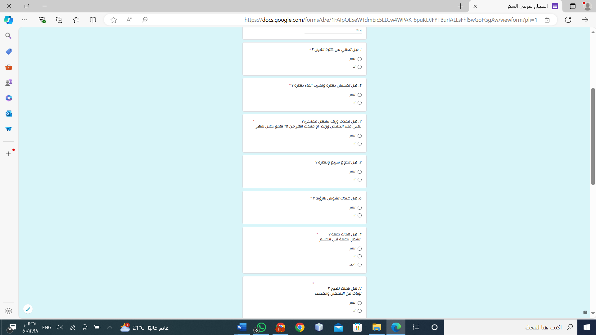

Figure (3:1) electronic questionnaire

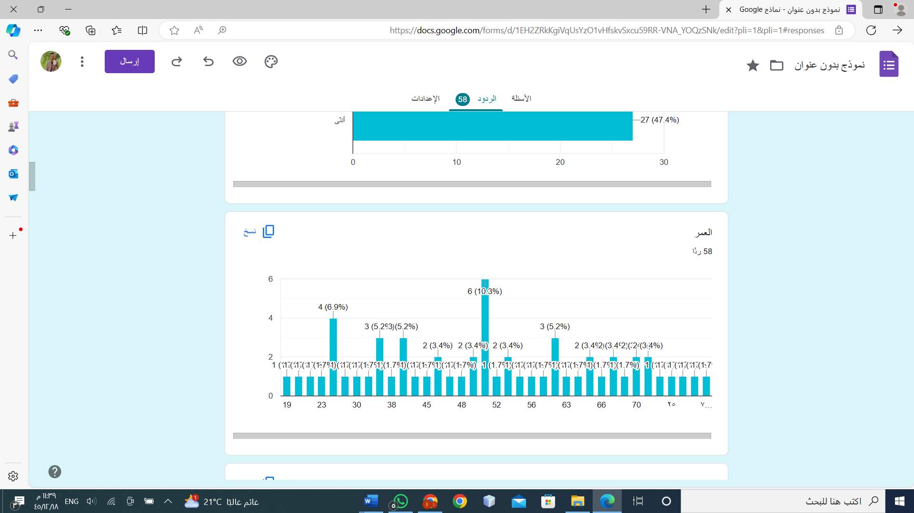
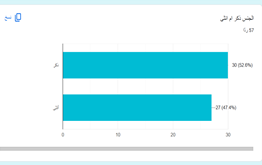

Figure (3:2) Age chart Figure (3:3) Gander chart

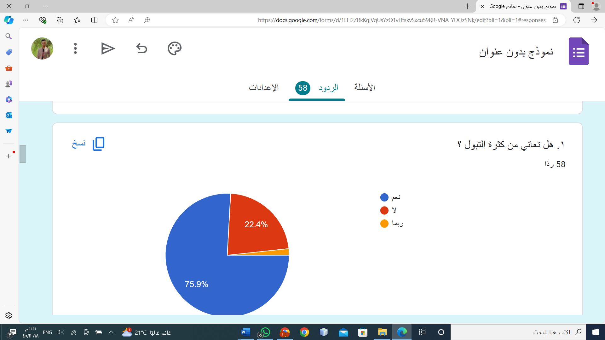

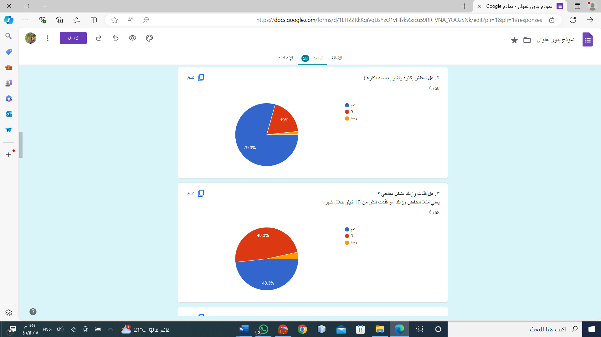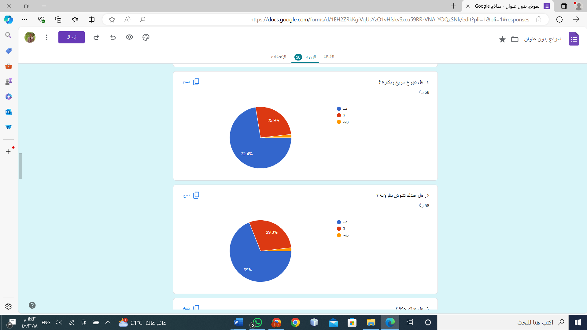

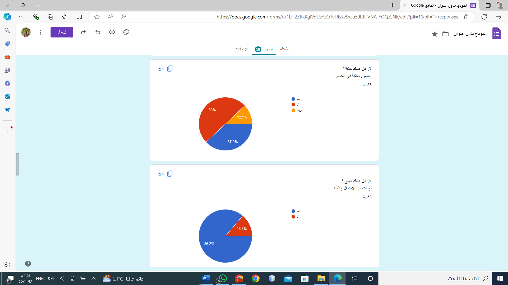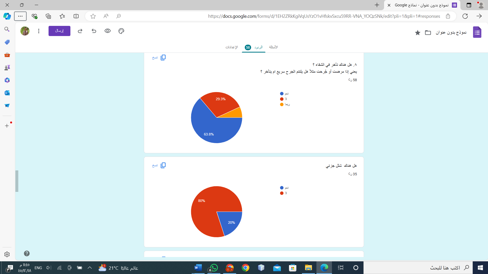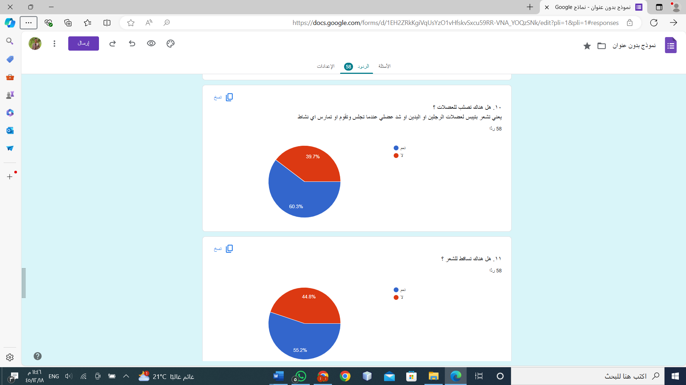


Figure (3:4) Symptoms model statistics

#### **3.2.1.3 Social Media Outreach**

Social media platforms were leveraged to reach a larger and more diverse
audience. Direct communication with individuals in diabetes support
groups and forums was initiated to gather reported symptoms and personal
experiences related to diabetes. This method provided access to
anecdotal data and personal stories that might not be captured through
traditional data collection methods. The engagement with online
communities also facilitated the collection of qualitative data,
providing deeper insights into the lived experiences of diabetic
individuals.

## **3.2.2 Model Development**

Model development is a critical phase in the research methodology,
involving the creation, training, and fine-tuning of machine learning
and deep learning models. This section details the development of three
models using deep neural networks (DNNs) to predict diabetes risk based
on the collected data. Each model is tailored to a specific dataset:
symptoms.

The symptoms-based model was trained on the dataset collected from field
visits, surveys, and social media outreach. This model is designed to
identify patterns in symptoms associated with diabetes.

#### **3.2.2.1 Data Preprocessing**

#### **Dataset Overview**

The dataset includes the following attributes:

- **Age**: Age of the patient (numeric).

- **Gender**: Gender of the patient (boolean).

- **Symptoms**: Boolean indicators for various symptoms including
  polyuria, polydipsia, sudden weight loss, weakness, polyphagia, visual
  blurring, itching, irritability, delayed healing, partial paresis,
  muscle stiffness, alopecia, and obesity.

- **Class**: Binary target variable indicating the presence (True) or
  absence (False) of diabetes.

1.  **Handling Missing Values**:

    - Missing values were observed only in boolean columns, which were
      represented as False values. These were imputed using the most
      frequent strategy to maintain data integrity and consistency.

2.  **Data Transformation**:

    - Boolean Conversion**:** Boolean columns were converted from their
      original string representations ("True" and "False") to actual
      boolean values (True and False).

3.  **Feature Engineering**:

- Categorical Encoding**:** The gender column, initially represented as
  boolean values, was further encoded into integers (0 for female and 1
  for male) to facilitate modeling.

#### **3.2.2.2 Insights and Findings**

**1.** **Symptom Distribution**

- Polyuria (frequent urination) and polydipsia (excessive thirst) are
  prevalent symptoms among patients with diabetes.

- Visual blurring and delayed healing also appear to be common symptoms.


Figure (3:5) polydipsia distribution

Figure (3:6) obesity
distribution

1.  **Gender Distribution**:

    - The dataset shows a balanced representation of genders, aiding
      inensuring model fairness and generalizability.


Figure (3:7) Gander distribution

2.  **Age Distribution**:

    - Age ranges widely among patients, spanning from early adulthood to
      senior years, reflecting the diverse demographic affected by
      diabetes

Figure (3:8) Age distribution


Figure (3:9) Symptom Distribution

#### **3.2.2.3 Data Normalization**

Continuous variables in the dataset were normalized to ensure they
contribute equally to the model's performance. This normalization
process helps in avoiding biases that may arise due to differences in
the scale of features. Two common methods used for normalization are
Min-Max scaling and standardization..

- **Min-Max Scaling**: This method scales the data to a fixed range,
  typically \[0, 1\]. It is achieved by subtracting the minimum value of
  the feature and then dividing by the range (difference between maximum
  and minimum values).

- **Standardization**: This method transforms the data to have a mean of
  0 and a standard deviation of 1. It involves subtracting the mean of
  the feature and dividing by the standard deviation.

**3.2.2.4 Data Cleaning and Preparation**

Prior to analysis and modeling, the dataset underwent essential cleaning
and preparation steps:

- **Handling Missing Values**: Any missing values were filled with the
  mean of the respective columns to ensure completeness and reliability
  of the dataset.

- **Categorical Data Encoding**: Categorical variables, such as gender,
  were encoded using Label Encoding. This transforms categorical values
  into numerical representations suitable for machine learning models.

>  style="width:5.70222in;height:4.27876in" />
>
> Figure (3:10) Data Cleaning and Preparation

#### 

#### **3.2.2.5 Model Architecture**

The architecture of a neural network is fundamental to its ability to
learn and generalize from data. The architecture for this project was
designed with the following considerations:

- **Input Layer**: This layer accepts the preprocessed input features.
  The number of nodes in this layer corresponds to the number of input
  features after preprocessing.

- **Hidden Layers**: Two hidden layers were incorporated into the model:

  - **First Hidden Layer**: This layer consists of 16 nodes. The
    activation function used is the Rectified Linear Unit (ReLU). The
    ReLU activation function is commonly used in neural networks because
    it helps mitigate the vanishing gradient problem, allowing the model
    to learn more effectively.

  - **Second Hidden Layer**: This layer consists of 8 nodes, also using
    the ReLU activation function.

- **Output Layer**: The output layer consists of a single node with a
  sigmoid activation function. The sigmoid function is suitable for
  binary classification tasks as it outputs a probability between 0 and
  1, indicating the likelihood of the positive class (i.e., the presence
  of diabetes).

<u>Algorithm Architecture</u>


(3:11) model Architecture

### **Model Training and Evaluation**

The training and evaluation of the models involved several meticulous
steps to ensure their reliability and effectiveness in predicting
diabetes risk.

####  **Training Process**

The training process for each model followed a structured approach
designed to optimize model performance and generalizability. Here are
the detailed steps involved:

- Data Splitting

The dataset was divided into three distinct subsets: training,

validation, and test sets. This partitioning allowed for proper
evaluation of the model's performance at different stages:

- **Training Set**: 70%

- **Validation Set**:15%.

- **Test Set**: Reserved for final evaluation of the model after all
  training and tuning.15%.

<!-- -->

- ***Model Training***

Once the data was prepared, the model training involved the following
key steps:-

- **Forward Propagation**: The input data was fed into the neural
  network, and through a series of interconnected layers, it underwent
  forward propagation. Activation functions introduced non-linearity
  into the model, enabling it to learn complex relationships within the
  data.

- **Back propagation**: This process involved calculating the gradients
  of the loss function with respect to each parameter of the model. It
  allowed for efficient adjustment of model weights to minimize
  prediction errors.

- **Weight Updates**: The Adam optimizer was utilized for updating model
  weights. Adam is known for its efficiency in handling large datasets
  and noisy data, making it suitable for optimizing neural networks


Figure (3:12) Model Training

### **3.3 Laboratory Measurements Model**

**3.3.1 Data Preprocessing**

- **Dataset Overview**

PIMA INDIAN DIABETES DATASET is a well-known dataset usually used in
outcome studies on machine learning and data mining. It consists of
medical quantitative data up to Pima Indian females with the purpose of
predicting the diabetes based on diagnostic measurements. The
information is useful for developing the model of diabetes and
identification of factors predisposing to this disease.

- ***Data Description***

The dataset includes 768 instances and 9 attributes:

- Pregnancies: Maternal pregnancy history

- Glucose: Plasma glucose fasting concentrations and 2 hours after the
  oral glucose tolerance test

- BloodPressure: Systolic blood pressure (mm Hg)

- SkinThickness: Triceps subcutaneous fat (mm)

- Insulin: Serum insulin two-hour (mu U/ml)

- BMI: Body Mass Index, calculated as weight in kilograms divided by the
  square of height in meters

- DiabetesPedigreeFunction: The probability of developing the disease
  given that one has a family history

- Age: \_Patient's age/ number of years\_

<!-- -->

- ***Summary Statistics***

Key statistics for each attribute:

- Pregnancies: Mean: 3. 85, SD: 3. 37, Range: 0-17

- Glucose: Mean: 120. 89, SD: 31. 97, Range: 0-199

- BloodPressure: Mean: 69. 11, SD: 19. 36, Range: 0-122

- SkinThickness: Mean: 20. 54, SD: 15. 95, Range: 0-99

- Insulin: Mean: 79. 80, SD: 115. 24, Range: 0-846

- BMI: Mean: 31. 99, SD: 7. 88, Range: 0-67. 1

- DiabetesPedigreeFunction: Mean: 0. 47, SD: 0. 33, Range: 0. 08-2. 42

- Age: Mean: 33. 24, SD: 11. 76, Range: 21-81

- Outcome: Mean: 0. 35, SD: 0. 48, Range: 0-1

These statistics show that some of the attributes have coefficients of
variations of more than one (e.g., insulin, skin thickness), and that
several attributes contain zeros, meaning that those measurements were
not taken, and thus require data pre-processing.

>  style="width:3.36528in;height:2.16528in" />

Figure (3:13) Summary Statistics

**3.3.2 Insights and Findings**

The Pima Indian Diabetes Dataset (PIDD) is used to develop predictive
models for diabetes mellitus based on specific diagnostic measurements.
This dataset contains medical attributes indicating diabetes, including
glucose concentration, blood pressure, skin thickness, insulin levels,
and BMI. Machine learning algorithms applied to this dataset can aid in
early detection and management of diabetes<span dir="rtl">.</span>

- ***Laboratory Measurements and Their Significance***

<!-- -->

- Glucose Concentration: Strong indicator of diabetes, measured after a
  two-hour oral glucose tolerance test.

- Blood Pressure: Associated with increased diabetes risk and
  cardiovascular health.

- Skin Thickness: Estimates body fat, which can increase diabetes risk.

- Insulin Levels: Indicates insulin resistance, a precursor to diabetes.

- BMI: Higher values correlate with increased diabetes risk.

<!-- -->

- ***Predictive Model and Analysis***

The model likely uses machine learning algorithms (e.g., logistic
regression, decision trees, random forests, neural networks) to analyze
these measurements and predict diabetes. Performance is evaluated using
metrics such as accuracy, precision, recall, and F1-score, providing
insights into the model's ability to distinguish between diabetic and
non-diabetic patients<span dir="rtl">.</span>

- ***Insights from the Model***

<!-- -->

- Feature Importance: Quantifies the importance of each feature in
  predicting diabetes.

- Predictive Accuracy: Indicates model reliability for clinical use.

- False Positives/Negatives: Crucial for assessing clinical
  applicability.

- ROC Curve and AUC: Represent the model's diagnostic ability.

<!-- -->

- ***Findings***

<!-- -->

- Glucose concentration is the most significant predictor of diabetes.

- BMI and insulin levels play substantial roles in the predictive model.

- Well-tuned models demonstrate high accuracy and reliability.

- Comprehensive data collection is crucial for improved model
  performance.

**3.3.3 Data Normalization**

Normalization of data is a method of the data preparation process
designed for altering the data for further analysis while preserving
relative differences and avoiding a significant variation in the range
of values. This process is important particularly for machine learning
algorithms as it can bring a noticeable increase of their performance
and stability in the learning process.

- ***Common normalization techniques include:***

<!-- -->

- **Min-Max Scaling:** Stretches the feature encompassing between 0 and
  1 but could be another range of values

- **Z-Score Standardization**: Rescales data to have a mean of 0 and a
  standard deviation of 1.

**3.3.4 Data Analysis and Pattern Discovery**

> Exploratory Data Analysis (EDA)

#### **Overview of EDA Process**

EDA is a process of gaining an understanding of the data sets and
especially an understanding of the parameters, structure, nature, and
other important aspects of data sets usually with graphical
illustrations. Here are some common steps in EDA:

- **Descriptive Statistics:** Finding arithmetic mean, median, and mode,
  variance, standard deviation, etc.

- **Visualization:** Plotting kinds of diagrams such as Histogram, Box
  plot, scatter plot and pair plot.

- **Detecting Outliers:** Identifying and handling outliers.

- **Identifying Patterns:** Making use of coefficients and constant
  patterns.

####  **Distributions of Key Features**

1.  **Age Distribution:**

The age distribution is positively skewed and therefore it shows the
majority of the participants are young people and the highest proportion
of those are in the age bracket of 20-25.


Figure (3:14) Age Distribution

2.  **Blood Pressure Distribution:**

Blood pressure is approximately normally distributed using 70-80 mm Hg
of diastolic blood pressure from a general population.

 The BMI results also show a
normal distribution, meanwhile having a peak around 30, with most
participants being considered overweight, which correlates with
prevalence of the risk factors for diabetes.

Figure (3:15) Blood Pressure Distribution

3.  **BMI Distribution:**

The shape of the glucose distribution is close to normal with the
maximum frequency in the area of 100 mg/dL. This means that most of the
populace possess normal glucose level but with larger numbers more than
the normal level, pointed to those with potential diabetes.


Figure (3:16) Clucose Distribution

#### **Correlation Analysis**

1.  ***Age vs. Diabetes Outcome***

    - **Age vs. Outcome Box Plot:**

> Based on this box plot, it can be observed that diabetic individuals
> are a little older than the non-diabetic persons. To sum it up, we can
> state that the age range of diabetes patients is greatly dispersed as
> well as their age is higher on average, which gives a proof to the
> fact that the factor of age shows the influence on the conception of
> diabetes.


Figure (3:17) Glucose Distribution

- **Age vs. Outcome Violin Plot:**

The violin plot gives additional information compared to the box plot
and it depicts the density of the distribution of ages. It proves that
the age distribution of patients with diabetes in one way or another is
more approximate, with a certain focus on elderly people in comparison
with other individuals.


Figure (3:18) Age vs Outcome

2.  ***BMI vs. Outcome***

    - **Box Plot Analysis:**

The box plot was constructed to display a BMI pattern and it presents
the following observations: Diabetic persons (Outcome = 1) have a higher
median value of BMI, more outputs and higher interquartile range
proposing higher variability in mean BMI of diabetics. On the other
hand, non-diabetic persons (Outcome = 0) have lower median BMI, less
numerous outliers and shorter IQR which means that there are lesser
variations in BMI of a particular person.


Figure (3:19) Age vs Outcome

The following box plot indicates the BMI distribution and it is
evidently seen that Outcome=1 (Diabetic patients) have higher median BMI
and the interquartile range is larger which means that there are many
patients with high BMI than the patients with low BMI. On the other
hand, 'Outcome = 0' that represents the non-diabetic group has a smaller
median BMI, less number of extreme values which are represented by the
whiskers and a smaller IQR thus indicating more density around the
mid-value implying that the BMI values are more uniform.


Figure (3:20) BMI vs. Outcome

3.  ***Glucose vs. BMI***

    - ***Scatter Plot Analysis:***

The third scatter plot is to demonstrate the correlation between glucose
levels and BMI, however, It is divided by diabetic and non-diabetic.
Thus, type 2 diabetics always have higher glucose concentrations
irrespective of their BMI indicating a direct relationship between BMI
and glucose. Non-diabetic population, on the other hand, is
characterized by lower glucose concentrations with markedly lesser
dependence of glucose levels on BMI.


Figure (3:21) BMI vs. Outcome

- **Scatter Plot of Age, Glucose, and BMI:**

<!-- -->

- The scatter plot of age, glucose, and BMI reveals important patterns
  and correlations among these variables. The plot demonstrates that
  individuals with higher glucose levels tend to have higher BMI values,
  particularly among older age groups. Diabetic individuals (Outcome
  = 1) generally display higher glucose levels and BMI across all age
  ranges, indicating a strong positive correlation between these
  variables and the likelihood of diabetes. Non-diabetic individuals
  (Outcome = 0) typically exhibit lower glucose levels and BMI, with a
  less pronounced correlation with age. This scatter plot underscores
  the importance of considering multiple factors simultaneously to
  understand the risk factors and prevalence of diabetes.

### 

Figure (3:22) Glucose vs. BMI

### ***Scatter Plot Matrix Analysis***

- The scatter plot matrix shows the interactions of the variables for
  thediabetics with the outcome value of; Outcome = 1 and non-diabetics
  with the Outcome = 0. Key observations from the scatter plot matrix
  include:

<!-- -->

- **Glucose Levels:**

However, the current study clearly distinguishes between the groups
concerning glucose level, revealing a noticeable cleavage between
diabetic and non-diabetic patients. Diabetic people generally have
increased blood sugar levels which is more appropriate to the diabetic
process.

- **BMI and Age:**

> Obesity pointed to high BMI values and patients with higher ages
> having a high probability of having diabetes. This is evident by
> central tendency by the orange points representing the Outcome of 1
> being spread within the higher values of these variables.

- **Blood Pressure:**

It should be noted, however, that diabetic individuals invariably have
slightly higher blood pressure than non-diabetic populations, although
there is certainly a fair amount of cross over.

- **Pregnancies:**

The relative frequency of the two outcomes demonstrates the spread of
pregnancy, which is, however, slightly higher in diabetic patients.

- **Inter-variable Relationships:**

From the scattered plots it can be assumed that there exists some
elements of relationship between the glucose level and BMI, age and the
glucose level, and the BMI and the blood pressure which may also point
towards some metabolic co-dependency.

Figure (3:23) Age vs Outcome  

- **Correlation Matrix**

> A correlation matrix is the summary of correlation coefficient with
> the help of the table. To understand the correlation between any two
> variables, one has to refer to the specific cell in the table. The
> value can be anywhere in between -1 up to 1. Where comparison of two
> variables is high it means the two variables are related strongly.

$$\text{Correlation Coefficient }(r) = \frac{\sum\left( X_{i} - \overline{X} \right)\left( Y_{i} - \overline{Y} \right)}{\sqrt{\sum\left( X_{i} - \overline{X} \right)^{2}\sum\left( Y_{i} - \overline{Y} \right)^{2}}}$$


Figure (3:24) Inter_variable Relationships

**3.3.5 Data Cleaning and Preparation**

> They included Data cleaning and preparation for Pima Indian Diabetes
> Dataset(PIDD).
>
> PIDD comprises demographic information and many laboratory
> measurements that are strictly related to diabetology. This section is
> about data cleaning and preparation step more specifically on handling
> missing values, encoding of categorical data, implementation, and
> issues.

- ***Handling Missing Values***

> Data missing is a type of incomplete observation found frequently in
> data sets and can have a big impact on a machine learning model's
> score. In PIDD, it is missing some data in the numerous features like
> glucose, blood pressure, skin thickness, insulin and BMI in form of
> zeros.

1.  **Identification of Missing Values:**

- It identifies entries that contain zero in the columns where zeros are
  not biologically possible such as glucose, blood pressure, skin
  thickness, and insulin level.

2.  **Imputation Methods:**

- **Mean/Median Imputation:** For numerical columns, one can use
  function mean

() or median () to replace the value in a missing cell with the mean or
the median of the column. It is easy to apply, but its presence of bias
depends with the distribution of data used in the analysis.

- **K-Nearest Neighbors (KNN) Imputation:** K nearest neighbor imputes
  missing

values based on the similarities of the instances. It can maintain more
of the relative variability and the interdependencies involved than mean
imputation.

- **Multiple Imputation:** This statistical method provides many
  estimated values

for a given amount missing value, in order words, the average is taken.
It accommodates the missing values by pointing out the level of
uncertainty regarding the missing values and appears to be even more
accurate than the other methods.

For instance, in PIDD, it is suitable for missing values in the
'glucose' column to be replaced with median of the absolute non-missing
glucose values in order to prevent a skewed distribution of glucose
values due to presences of outliers.

\# Load the dataset

data = pd.read_csv('app/data/diabetes_datasett.csv')

\# Handle missing values

imputer = SimpleImputer(strategy='mean')

- ***Implementation***

The following code snippet provides an implementation of data cleaning
and preparation using the discussed techniques:

\# Load the dataset

data = pd.read_csv('app/data/diabetes_datasett.csv')

\# Handle missing values

imputer = SimpleImputer(strategy='mean')

data.iloc\[:, :-1\] = imputer.fit_transform(data.iloc\[:, :-1\])

\# Encode the 'Outcome' column

label_encoder = LabelEncoder()

data\['Outcome'\] = label_encoder.fit_transform(data\['Outcome'\])

- ***Considerations***

<!-- -->

- Understanding the Nature of Missing Data: The type of missing
  transmission must be established, and this may include missing at
  random (MAR), missing completely at random (MCAR), or missing not at
  random (MNAR). This understanding dictates the selection of the method
  to be used to impute missing values.

- Potential Bias from Imputation: Although, imputation can be useful in
  maintaining the number of cases to be analyzed, its disadvantage is
  that it brings in bias. Some of this bias can be controlled with
  methods such as multiple imputation.

- Impact on Model Performance: Essentially, the methods used in data
  preparation have great influence in determining the model's quality
  and credibility. The imputation and encoding process should be green
  mean through cross-validation and checking for metrics in the model.

Data cleaning and preprocessing form the prior phase of building sound
predictive models. Thus, the management of missing data values and the
correct representation of categorical variables are crucial for the
improvement of the model's performance and accuracy of predictions.

**3.3.6 Model Structure**

> The model for the Pima Indian Diabetes Dataset (PIDD) is set with
> Keras Sequential API which is optimal when used to establish
> feedforward neural networks. The main goal is to forecast the
> potential of diabetes utilizing numerous characteristics, including
> laboratory findings. The architecture entails the input layer, hidden
> layers, and the output layer. Below is a detailed explanation of the
> model structure based on the provided code: Below is a detailed
> explanation of the model structure based on the provided code:
>
> \# Create the model
>
> model = Sequential()
>
> model.add(Dense(128, input_shape=(X_train.shape\[1\],),
> activation='relu'))
>
> model.add(Dropout(0.3))
>
> model.add(Dense(64, activation='relu'))
>
> model.add(Dropout(0.3))
>
> model.add(Dense(32, activation='relu'))
>
> model.add(Dense(1, activation='sigmoid'))

- ***Model Layers***

1.  **Input Layer**:

- The input layer is defined by specifying the shape of the input using
  the input_shape parameter. The input shape corresponds to the number
  of features in the training dataset (X_train.shape\[1\]).

- This layer acts solely as a receiver, taking in the input data and
  passing it into the neural network without performing any mathematical
  operations.

2.  **First Hidden Layer:**

- Dense(128, activation='relu'): This fully connected layer consists of
  128 neurons and is fully connected to the previous layer. The ReLU
  (Rectified Linear Unit) activation function is employed here to
  introduce non-linearity.

- Dropout(0. 3)\`: This is a regularization technique where 30% of the
  neurons are randomly set to zero at the start of each training epoch
  to help prevent overfitting.

3.  **Second Hidden Layer:**

- Dense(64, activation='relu'): This is another fully connected layer
  that contains 64 neurons and also utilizes the ReLU activation
  function.

- Dropout(0. 3)\`: Similar to the first hidden layer, this layer is
  followed by a dropout layer with a dropout rate of 30%.

4.  **Third Hidden Layer:**

- Dense(32, activation='relu' This layer, which is the final hidden
  layer, consists of 32 neurons and uses the ReLU activation function to
  refine the features learned from the previous layers.

5.  **Output Layer:**

- Dense(1, activation='sigmoid')\`: The output layer consists of a
  single neuron with a full connection. The sigmoid activation function
  is used to generate a probability output between 0 and 1, which is
  crucial for binary classification tasks, such as predicting the
  presence of diabetes.

<!-- -->

- ***Model Compilation***

After establishing the structure of the model, the Adam optimizer is
applied as the optimization function, while the binary cross-entropy is
used as the loss function. The evaluation metric utilized is accuracy.

- **Early Stopping**

To prevent overfitting and ensure that the model does not train for too
long, early stopping is implemented. This technique monitors the
validation loss and stops training if the loss does not improve for a
specified number of epochs (referred to as patience).

- **Model Training**

The model is trained using the training dataset with a validation split
of 20%. The *fit* method is used to train the model over a specified
number of epochs with a given batch size. Early stopping is applied
during the training process.

history = model.fit(X_train, y_train, epochs=200, batch_size=32,
validation_split=0.2, callbacks=\[early_stopping\])

- **Data Splitting**

A critical aspect in constructing a machine learning model is the proper
distribution of the dataset. This process involves separating some data
for training the model and other data for testing to achieve higher
accuracy on unseen data. The dataset is divided into a training set and
a testing set, and sometimes a validation set is also included

From the provided code, the dataset is split into training and testing
sets using an 80-20 ratio. This split is implemented using the
train_test_split function from the scikit-learn library.

\# Load the dataset

data = pd.read_csv('app/data/diabetes_datasett.csv')

\# Define features and target

X = data.drop('Outcome', axis=1)

y = data\['Outcome'\]

\# Split the dataset into training and testing sets

X_train, X_test, y_train, y_test = train_test_split(X, y, test_size=0.2,
random_state=42)

- **Cross-Validation**

To evaluate the model's performance, cross-validation is performed using
the cross_val_score function from scikit-learn. A KerasClassifier
wrapper is used to integrate the Keras model with scikit-learn's
cross-validation tools.

def create_model():

    model = Sequential()

    model.add(Dense(128, input_shape=(X_train.shape\[1\],),
activation='relu'))

    model.add(Dropout(0.3))

    model.add(Dense(64, activation='relu'))

    model.add(Dropout(0.3))

    model.add(Dense(32, activation='relu'))

    model.add(Dense(1, activation='sigmoid'))

    model.compile(optimizer='adam', loss='binary_crossentropy',
metrics=\['accuracy'\])

    return model

model_cv = KerasClassifier(model=create_model, epochs=200,
batch_size=32, verbose=0)

scores = cross_val_score(model_cv, X_train, y_train, cv=5,
scoring=make_scorer(accuracy_score))

print(f'Cross-validation accuracy: {scores.mean()}')

**3.3.7 Hyperparameter Tuning**

Hyperparameter tuning involves modifying the hyperparameters of a model
to achieve the best performance. The provided code utilizes feature
selection via GridSearchCV from scikit-learn for hyperparameter
optimization. GridSearchCV performs a brute-force search over a defined
set of parameters to train and test the model using cross-validation.

The hyperparameters being tuned include:

- Neurons in each Fully connected layer.

The number of neurons in the dense layers was experimented with at 32,
64, and 128 neurons. A configuration of 64 neurons provided sufficient
learning capability with a minimal risk of overfitting, while 32 neurons
were suitable for less complex patterns. In contrast, 128 neurons were
appropriate for more complex patterns but required careful
regularizatio.

- Dropout rate.

Dropout rates of 0.0, 0.3, and 0.5 were tested. A rate of 0.3 offered
optimal protection against overfitting while maintaining the ability to
learn from new data effectively. This configuration minimized
overfitting while allowing for adequate learning capacity. A rate of 0.5
provided high regularization capability, although it may have slowed
convergence.

- Batch size.

The current work tested the following number of participants per batch:
16, 32 and 64. , whereas, a batch size of 16 trained the network more
often but slowly and 64 trained the network faster but may not converge
well.

- Number of epochs

The tentative values for the number of epochs tested were 100 and 200.
An epoch represents one complete pass through the entire dataset.
Training the model for 200 epochs was beneficial, as it provided
adequate learning opportunities without significantly increasing the
risk of overfitting.

**3.3.8 Regularization Techniques**

In the general sense, it is used to overcome overfitting by adding a
constraint to models which makes the coefficients large. Among the
commonly used techniques in neural networks both global and local minima
are handled by dropout and weight regularization (L1 and L2).

- ***Dropout:***

<!-- -->

- Dropout is used to mitigate overfitting by randomly ignoring a subset
  of input features during each iteration of the training phase. This
  approach encourages the network to learn multiple representations of
  the same input, which may extend training time.

- The model incorporates dropout layers with varying dropout rates to
  introduce regularization into the training process.

<!-- -->

- ***L1 and L2 Regularization:***

<!-- -->

- **L1 Regularization (Lasso):** This technique adds a penalty equal to
  the absolute values of the coefficients' magnitudes, encouraging
  sparse weight distributions.

- **L2 Regularization (Ridge):** This method adds a penalty equal to the
  square of the coefficients' values, which helps in reducing the
  magnitude of the weights.

- The model incorporates dropout layers with varying dropout rates to
  introduce regularization into the training process.

**3.3.9 Training Process**

- ***Data Preparation***

The dataset is loaded and preprocessed such that missing values are
replaced with the mean using an imputer. Following this, the data is
separated into features (independent variables, denoted as X) and the
target (dependent variable, denoted as y). The dataset is then divided
into training and testing sets using an 80/20 ratio. Standardization
ensures that all features have a mean of zero and a standard deviation
of one, which is optimal for most algorithms to converge effectively.

- ***Model Architecture***

The model is built using Keras' Sequential API with several layers:

- Input layer: 128 neurons, ReLU activation.

- Dropout layer: 0. 3 rate in order to/generalize the model from the
  training data and avoid overfitting.

- Hidden layer: Models: 64 neurons, activation ReLU.

- Dropout layer: 0. 3 rate.

- Hidden layer: 32 neurons, ReLU.

- Output layer: 1 neuron, sigmoid activation if it is a binary
  classification problem.

The model is trained under the Adam optimizer with binary cross entropy
as the loss function; the model's performance is evaluated in terms of
accuracy.

- ***Training the Model***

The model is trained with an early stopping on the validation loss in
order to avoid overfitting that involves halting the training process in
case the validation loss does not show an improvement for the next ten
epochs. It trains for up to 200 epochs at a time with a batch size of 32
and 20% of the samples set aside for validation.

- ***Training Metrics***

Metrics monitored during training include:

- Accuracy: This represents the percentage of correct predictions made
  by the model against the true labels. The training accuracy at the end
  is approximately 83.37%. Self-testing accuracy is nearly 78%, and
  cross-validation accuracy is approximately 74.80%.

- Loss: This measures how well the predictions align with the true
  labels. A low loss indicates good fitting. The training loss is about
  0.3848, while the validation loss remains around 0.4748.

<!-- -->

-  ***Evaluation on the Test Set***

> After completing the training, the model's performance is evaluated to
> assess its generalization capabilities.

- **Cross-Validation:** Cross-validation with K = 5 is performed to
  evaluate accuracy on unseen data, resulting in an average accuracy of
  approximately 74.80%, ensuring consistent performance.

- **Final Evaluation:** This step validates the model's ability to
  generalize to new data that it has not encountered before. The
  accuracy and loss of the test set are compared with those of the
  training and validation sets, showing minimal deviation, which
  illustrates equivalent performance across different sets and indicates
  no signs of overfitting or underfitting.

> This comprehensive approach, which includes data preprocessing, model
> construction, early stopping, and cross-validation, enhances the
> model's capability to perform well on new data.

**3.4 Lifestyle Factors-Based Model**

In the context of diabetes prediction, lifestyle factors such as smoking
history, hypertension, and heart disease play a crucial role. This
details the development, training, and evaluation of a natural networks
model aimed at predicting diabetes based on these factors. The model
leverages a dataset with various lifestyle and health-related features.

>  style="width:5.03679in;height:3.22553in" />
>
> Figure (3:25) Correlation Matrix

#### **3.4.1 Data Preprocessing**

**1. Dataset Overview**

The dataset used for this project comprises 100,000 entries with nine
features: gender, age, hypertension, heart_disease, smoking_history,
bmi, HbA1c_level, blood_glucose_level, and diabetes. The data is sourced
from a healthcare setting, providing a mix of demographic, health, and
medical test data, crucial for predicting diabetes.

- ***Data Description:***

<!-- -->

- **Gender:** Categorical feature with values "Male" and "Female".

- **Age:** Continuous feature representing the age of the individual.

- **Hypertension:** Binary feature indicating the presence (1) or
  absence (0) of hypertension.

- **Heart Disease:** Binary feature indicating the presence (1) or
  absence (0) of heart disease.

- **Smoking History:** Categorical feature with values "never",
  "former", "current", "ever", and "No Info".

- **BMI:** Continuous feature representing the Body Mass Index of the
  individual.

- **HbA1c Level:** Continuous feature indicating the average blood sugar
  level over the past 3 months.

- **Blood Glucose Level:** Continuous feature representing the current
  blood glucose level.

- **Diabetes:** Binary target variable indicating the presence (1) or
  absence (0) of diabetes.

<!-- -->

- **Summary Statistics:**

> The following summary statistics provide a snapshot of the dataset:

- **Age:** Mean = 41.89, Std = 22.52, Min = 0.08, Max = 80.

- **BMI:** Mean = 27.32, Std = 6.64, Min = 10.01, Max = 95.69.

- **HbA1c Level:** Mean = 5.53, Std = 1.07, Min = 3.5, Max = 9.0.

- **Blood Glucose Level:** Mean = 138.06, Std = 40.71, Min = 80, Max =
  300.

- **Hypertension:** 7.5% of individuals have hypertension.

- **Heart Disease:** 3.9% of individuals have heart disease.

- **Diabetes:** 8.5% of individuals have diabetes.

The data is well-distributed across different age groups and health
conditions, providing a comprehensive foundation for building a
predictive model.


Figure (3:26) Lifestyle factor

#### **3.4.2 Insights and Findings**

**1. Gender Distribution**

- The dataset has a balanced representation of males and females. Both
  genders exhibit similar patterns in terms of diabetes prevalence.

- **Age Distribution:** Younger individuals (below 40) are less likely
  to have diabetes, whereas older age groups show a higher incidence.

- **BMI Distribution:** Higher BMI values are correlated with an
  increased likelihood of diabetes. This aligns with existing medical
  literature linking obesity to diabetes.

- **HbA1c and Blood Glucose Levels:** Elevated HbA1c and blood glucose
  levels are strong indicators of diabetes.

These insights guided the feature engineering process and helped shape
the model architecture.


Figure (3:27) Summary statics


Figure (3:28) Feature Distribution

#### **3.4.3 Data Normalization**

To ensure that all features contribute equally to the model and to
improve the convergence speed of the learning algorithm, we normalized
the numerical features. Standardization was used, transforming the data
to have a mean of 0 and a standard deviation of 1. The following
features were normalized:

- **Age**

- **BMI**

- **HbA1c Level**

- **Blood Glucose Level**

Normalization helps in handling features that span different ranges and
ensures that the model does not become biased towards features with
larger ranges.

`from sklearn.preprocess``ing import StandardScaler``
scaler = StandardScaler()``
data[['age', 'bmi', 'HbA1c_level', 'blood_glucose_level']] = scaler.fit_transform(data[['age', 'bmi', 'HbA1c_level', 'blood_glucose_level']])`

#### **3.4.4 Data Analysis and Pattern Discovery**

- **Exploratory Data Analysis (EDA)**

Exploratory Data Analysis was conducted to understand the relationships
between different features and the target variable (diabetes). Key
findings include:

- **Age**: The likelihood of diabetes increases with age. Individuals
  aged 60 and above show a higher prevalence.

- **BMI**: A positive correlation between BMI and diabetes was observed.
  Individuals with a BMI over 30 are at a higher risk.

- **HbA1c Level**: HbA1c levels above 6.5% are indicative of diabetes.
  This threshold is consistent with clinical guidelines.

- **Blood Glucose Level**: Blood glucose levels above 140 mg/dL are
  commonly associated with diabetes.

Visualizations such as histograms, box plots, and scatter plots were
used to illustrate these relationships. For instance, a scatter plot of
HbA1c level vs. blood glucose level shows a clear distinction between
diabetic and non-diabetic individuals.

- **Correlation Matrix**

A correlation matrix was created to identify the strength of
relationships between features. High correlation was observed between:

- **HbA1c Level and Blood Glucose Level**: Strong positive correlation,
  indicating that individuals with high blood glucose levels tend to
  have high HbA1c levels.

- **Age and Diabetes**: Moderate positive correlation, reinforcing the
  link between age and diabetes prevalence.

These correlations were critical in guiding feature selection and
engineering.


Figure (3:29) Age and Gender Distribution

#### **3.4.5 Data Cleaning and Preparation**

- **Handling Missing Values**

Missing values were present in both numerical and categorical columns.
The following strategies were employed:

- **Numerical Columns**: Missing values were filled with the median of
  each column. This approach is robust against outliers.

- **Categorical Columns**: Missing values were filled with the most
  frequent value in each column. This simple imputation method works
  well given the balanced distribution of categories.

`data['age'].fillna(data['age'].median(), inplace=True)``
data['bmi'].fillna(data['bmi'].median(), inplace=True)``
data['HbA1c_level'].fillna(data['HbA1c_level'].median(), inplace=True)``
data['blood_glucose_level'].fillna(data['blood_glucose_level'].median(), inplace=True)``
data['smoking_history'].fillna(data['smoking_his``tory'].mode()[0], inplace=True)`

- **Encoding Categorical Data**

Categorical variables such as gender and smoking history were converted
into dummy variables to enable their use in the model. This process
involves creating binary columns for each category:

`data = pd.get_dummies(data, columns=['gender', 'smok``ing_history'], drop_first=True)`

- **Normalization**

To ensure that all features contribute equally to the model, numerical
columns (age, bmi, HbA1c_level, and blood_glucose_level) were normalized
using StandardScaler, which scales the data to have a mean of 0 and a
standard deviation of 1.

- **Understanding the Data**

Your dataset includes numeric features with varying ranges:

- **age**: ranges from 0.08 to 80.

- **bmi**: ranges from 10.01 to 95.69.

- **HbA1c_level**: ranges from 3.5 to 9.0.

- **blood_glucose_level**: ranges from 80 to 300.

<!-- -->

- **Standardization (Z-score Normalization)**

Standardization would transform each feature to have a mean of 0 and a
standard deviation of 1. This method is useful when the distribution of
your data is not normal or when you want to preserve the shape of the
original distribution.

- **Formula**: $X_{\text{std}} = \frac{X - \mu}{\sigma}$

  - $X$: Original value of the feature.

  - $\mu$: Mean of the feature $X$.

  - $\sigma$: Standard deviation of the feature $X$.

- Example using `StandardScaler` from `sklearn`:

Applying this to your dataset would scale each feature so that they have
a mean of 0 and a standard deviation of 1.

- **Min-Max Scaling (Normalization)**

Min-max scaling transforms data to a fixed range, typically \[0, 1\].
This method is useful when you want to preserve the exact relationships
between data points and when your data doesn't follow a normal
distribution.

- **Formula**:
  $X_{\text{norm}} = \frac{X - X_{\text{min}}}{X_{\text{max}} - X_{\text{min}}}$

  - $X$: Original value of the feature.

  - $X_{\text{min}}$: Minimum value of the feature $X$.

  - $X_{\text{max}}$: Maximum value of the feature $X$.

- Example using `MinMaxScaler` from `sklearn`:

Applying this to your dataset would scale each feature to the range \[0,
1\].

- ***Considerations***

1.  **Impact on Model**: Normalization ensures that all features
    contribute equally to the model training process, which is important
    for algorithms like neural networks, SVMs, and KNN.

2.  **Handling Outliers**: Standardization is less sensitive to outliers
    compared to min-max scaling, which can distort the normalization
    process.

3.  **Interpretability**: Normalization alters the scale of features,
    which can affect the interpretability of coefficients in linear
    models.

**3.4.6 Model Architecture**

The predictive model was built using a Sequential Neural Network. Neural
networks are well-suited for this type of problem due to their ability
to capture complex, non-linear relationships between features.

- **Model Structure**

The model architecture comprises the following layers:

1.  **Input Layer:**

    - 64 neurons

    - ReLU activation function

2.  **Hidden Layers:**

    - ***1st Hidden Layer:***

      - 128 neurons

      - ReLU activation function

      - Dropout (0.5)

    - ***2nd Hidden Layer:***

      - 64 neurons

      - ReLU activation function

3.  **Output Layer:**

    - ***1 neuron***

    - ***Sigmoid activation function***

The ReLU (Rectified Linear Unit) activation function was chosen for its
ability to introduce non-linearity into the model while avoiding the
vanishing gradient problem. Dropout was applied to the first hidden
layer to prevent overfitting.

`from keras.models import Sequential``
from keras.layers import Dense, Dropout``
``
model = Sequential()``
model.add(Dense(64, input_dim=12, activation='relu'))``
model.add(Dense(128, activation='relu'))``
model.add(Dropout(0.5))``
model.add(Dense(64, activation='relu'))``
model.add(``Dense(1, activation='sigmoid'))`

>  style="width:2.76847in;height:4.26672in" />
>
> Figure (3:30) Correlation Matrix

**3.4.7 Model Training and Evaluation**

- **Data Splitting**

The dataset was split into training, validation, and test sets:

1.  **Training Set:** 80% of the data

2.  **Validation Set:** 10% of the data

3.  **Test Set:** 10% of the data

This split ensures that the model is trained on a substantial portion of
the data while also allowing for performance evaluation on unseen data.

`from sklearn.model_se``lection import train_test_split``
X = data.drop('diabetes``', axis=1)``
y = data['diabetes']``
``X_train, X_temp, y_train, y_temp = train_test_split(X, y, test_size=0.2, random_state=42)``
X_val, X_test, y``
_val, y_test = train_test_split(X_temp, y_temp, test_size=0.5, ``random_state=42)`

- **Model Training**

The model was compiled using the Adam optimizer and binary cross-entropy
loss function. Early stopping was implemented to halt training when the
validation loss stopped improving, with a patience of 10 epochs.

**3.4.8 Regularization Techniques**

To mitigate overfitting and improve generalization, the following
regularization techniques were applied:

- **Dropout:** Dropout layers with a dropout rate of 0.5 were added to
  the model. This technique randomly drops units during training,
  preventing the network from becoming too reliant on specific neurons.

- **Early Stopping:** Monitored validation loss and stopped training
  when performance ceased to improve, preventing overfitting on the
  training data.

- **L2 Regularization:** Also known as weight decay, L2 regularization
  penalizes large weights, encouraging the model to keep weights small
  and simple.

**3.4.9 Training Process**

The training process involved monitoring key metrics such as loss and
accuracy on both the training and validation sets. Training was
conducted for up to 100 epochs, with early stopping typically halting
training around the 30th epoch based on validation performance.

- ***Training Metrics***

The following metrics were recorded during training:

- **Training Loss:** Gradually decreased, indicating effective learning.

- **Validation Loss:** Monitored to detect overfitting. Early stopping
  was triggered when the validation loss ceased to improve.

- **Accuracy:** Steadily increased, with the final model achieving high
  accuracy on both training and validation sets.

**3.5 Devlopment Web Application**

**3.5.1 Introduction**

- Diabetes is a chronic health condition that affects how the body turns
  food into energy. Accurate and early detection of diabetes is crucial
  for effective management and treatment. In this project, we have
  developed a web application using deep neural networks (DNN) to
  predict the likelihood of diabetes in individuals based on various
  input parameters.

<!-- -->

- **Objectives**

<!-- -->

- The main objectives of this project are:

- To develop a system that can accurately predict the presence of
  diabetes using different models based on symptoms, laboratory
  measurements, and causes.

- To create a user-friendly web interface that allows users to input
  their data and get instant predictions.

- To provide visualizations and reports to help users understand their
  health better.

**3.5.2 File Structure**

 The project is organized
into various directories and files, each serving a specific purpose.
Below is a detailed breakdown of the file structure:

Figure (3:31) Neural network Architecture

3.  **System Architecture**

- **Overview**

The system architecture is designed to seamlessly integrate various
components of the web application, including the user interface, backend
processing, and the machine learning models. The architecture ensures
efficient data flow and real-time prediction capabilities.

1.  **Data Flow**

The data flow in the system follows these steps:

- User inputs data through the web interface.

- The input data is preprocessed and scaled.

- The appropriate model is selected based on the input type.

- The model processes the data and generates a prediction.

- The prediction is displayed to the user along with the accuracy of the
  model.

  3.  **Models Development**

<!-- -->

- **Symptom-Based Model**

This model uses a dataset created from visible and important symptoms of
diabetes patients. The dataset includes features such as polyuria,
polydipsia, weight loss, polyphagia, visual blurring, itching,
irritability, delayed healing, muscle stiffness, alopecia, weakness,
partial paresis, and obesity.

- **Laboratory Measurements Model**

This model is built using laboratory measurements such as insulin and
glucose levels in the blood. It utilizes the Pima Indian dataset, which
is a well-known dataset for diabetes prediction.

- **Causes and Practices Model**

This model focuses on the causes and practices that lead to diabetes
among individuals. It includes features such as age, gender,
hypertension, heart disease, smoking history, BMI, HbA1c level, and
blood glucose level.

3.  **Web Application**

**3.5.5.1 Framework and Tools**

The web application is built using the Flask framework in Python. Flask
is a lightweight and flexible framework that is ideal for developing web
applications with complex functionalities.

**3.5.5.2 Website Structure**

The website consists of several pages, each designed for a specific
function. The main pages include:

- **Home Page**: Provides an overview of the application and its
  purpose.

- **Predict Page**: Allows users to input their data and get
  predictions.

- **Visualization Page**: Displays visualizations of the data and model
  predictions.

- **About Page**: Provides information about the project and its
  developers.

- **Reports Page**: Contains detailed reports of the predictions and
  model performance.

**3.5.5.3 Data Processing and Interaction**

The interaction between the user and the application involves several
steps:

- **Data Input**: Users fill out forms with their data.

- **Data Processing**: The input data is preprocessed, scaled, and fed
  into the appropriate model.

- **Prediction**: The model processes the data and generates a
  prediction.

- **Result Display**: The prediction results are displayed to the user
  along with the accuracy of the model.

**3.5.5.4 Features and Goals**

**Key Features**

- **Multiple Prediction Models**: Provides predictions based on
  symptoms, laboratory measurements, and causes.

- **User-Friendly Interface**: Easy-to-use web interface for data input
  and result display.

- **Real-Time Predictions**: Instant predictions with high accuracy.

- **Detailed Reports**: Comprehensive reports and visualizations to help
  users understand their health better.

<!-- -->

- **Goals**

<!-- -->

- To provide an accurate and reliable system for early detection of
  diabetes.

- To offer a user-friendly platform for users to get predictions and
  insights into their health.

- To enhance the understanding and management of diabetes through data
  and technology.

**3.5.6 Challenges and Limitations**

**3.5.6.1 Technical Challenges**

- **Data Quality**: Ensuring the quality and reliability of the input
  data.

- **Model Accuracy**: Achieving high accuracy and reliability in
  predictions.

- **Scalability**: Ensuring the system can handle multiple users and
  large datasets.

**3.5.6.2 Limitations**

- **Data Dependency**: The accuracy of predictions is highly dependent
  on the quality and completeness of the input data.

- **Model Generalization**: The models may not generalize well to unseen
  data or different populations.

- **Resource Intensive**: Deep learning models require significant
  computational resources for training and prediction.

**3.5.7 Requirements**

- **Hardware Requirements**

1.  A modern computer with a multi-core processor.

2.  At least 16GB of RAM.

3.  Sufficient storage space for datasets and models.

4.  GPU support for faster training and predictions (optional).

- **Software Requirements**

<!-- -->

- Python 3.x

- Flask

<!-- -->

- TensorFlow/Keras

<!-- -->

- NumPy

- Pandas

- Scikit-learn

- Plotly

- Jinja2

- Any other dependencies as specified in the `requirements.txt` file

**3.5.8 Techniques and Technologies Used**

**3.5.8.1 Deep Learning Techniques**

- **Neural Networks**: Utilized for creating models that can learn
  complex patterns from data.

- **Backpropagation**: Used for training the neural networks by
  adjusting weights based on error rates.

- **Activation Functions**: Applied to introduce non-linearities in the
  model (e.g., ReLU, Sigmoid).

**3.5.8.2 Tools and Libraries**

- **Flask**: A micro web framework for Python, used to create the web
  application.

- **TensorFlow/Keras**: Libraries for building and training neural
  network models.

- **Scikit-learn**: Used for preprocessing data, feature scaling, and
  model evaluation.

- **Plotly**: Used for creating interactive visualizations.

- **Pandas**: For data manipulation and analysis.

- **NumPy**: For numerical computations.

**3.5.9 Use Cases**

1.  **Use Case Scenarios**

- **Individual Health Monitoring**: Users can input their symptoms,
  laboratory results, and lifestyle factors to get a prediction on their
  likelihood of having diabetes.

- **Healthcare Providers**: Doctors and healthcare professionals can use
  the tool to get preliminary insights into a patient's risk of
  diabetes, aiding in diagnosis and treatment planning.

- **Research and Analysis**: Researchers can use the system to analyze
  the impact of various factors on diabetes and to validate hypotheses
  using the provided datasets and models.

**3.5.10 Screenshot of the Output:**

- **Home Page**

<!-- -->

- **Description**: The home page provides an overview of the application
  and its purpose. It serves as the entry point for users to navigate to
  different sections of the web application.


Figure (3:32) File Structure


> Figure (3:33) Home Page

- **Predict Pages**

**1. Symptom-based Prediction Page**

- **Description**: This page allows users to input their symptoms to
  receive a prediction on the likelihood of having diabetes based on
  their symptoms. This page corresponds to `medical_exam1.html`.


Figure (3:34) Home Page Arabic

**2. Laboratory Measurements Prediction Page**

- **Description**: This page allows users to input laboratory results to
  receive a prediction on the likelihood of having diabetes based on
  these measurements. This page corresponds to `medical_exam.html`.


Figure (3:35) Sympotom­-based model page

**3. Risk Factors Prediction Page**

1.  **Description**: This page allows users to input their lifestyle and
    other risk factors to receive a prediction on the likelihood of
    having diabetes based on these factors. This page corresponds to
    `medical_exam2.html`.


Figure (3:36) Laboratory Measurements Model page

- **Result Pages**

**1. Symptom-based Result Page**

- **Description**: This page displays the prediction results based on
  the symptoms provided by the user. It includes the likelihood of
  having diabetes and the model's confidence in the prediction.


Figure (3:37) LifeStayle Page

**2. Laboratory Measurements Result Page**

- **Description**: This page displays the prediction results based on
  the laboratory measurements provided by the user. It includes detailed
  results and insights from the analysis.


Figure (3:38) Sympotom­-based model Result page

**3. Risk Factors Result Page**

- **Description**: This page displays the prediction results based on
  the risk factors provided by the user. It offers a detailed assessment
  of the risk based on lifestyle and other factors.


Figure (3:39) Laboratory Measurements Model Result Page

- **Reports Pages**

1.  **Symptom-based Report Page**

- **Description**: This page contains detailed reports of the
  predictions based on symptoms. It includes analysis, visualizations,
  and insights derived from the symptom-based data.


Figure (3:40) LifeStayle Results Page

2.  **Laboratory Measurements Report Page**

- **Description**: This page contains detailed reports of the
  predictions based on laboratory measurements. It provides
  comprehensive analysis and visualizations of the lab data.


Figure (3:41) Sympotom­-based model Report page

3.  **Risk Factors Report Page**

- **Description**: This page contains detailed reports of the
  predictions based on risk factors. It includes thorough analysis and
  visualizations of the risk factor data.


Figure (3:42) Sympotom­-based model Report page

- **Visualization Page**

<!-- -->

- **Description**: The visualization page offers visual insights into
  the data and predictions. It includes charts and graphs to help users
  understand the patterns and trends in their health data.


Figure (3:43) LifeStyle Report Page

- **About Page**

<!-- -->

- **Description**:The about page provides information about the
  diabetes, project, its goals, and the team behind it. It helps users
  understand the motivation and objectives of the diabetes detection
  system.


Figure (3:44) Visualization Page


Figure (3:45) About Page


Figure (3:46) About Page


Figure (3:47) About Page

>  style="width:6.10208in;height:3.43264in" />

Figure (3:48) About Page

>  style="width:6.10208in;height:3.43264in" />

Figure (3:49) About Page

>  style="width:6.10208in;height:3.43264in" />

Figure (3:50) About Page

> Table (3:1) Tools and techniques used


*Figure: Python programming language*


*Figure: Flask web framework*


*Figure: Scikit-learn library*


*Figure: NumPy library*


*Figure: Pandas library*


*Figure: Plotly visualization library*


*Figure: Jinja2 templating engine*


*Figure: Jupyter Notebook*


*Figure: VS Code editor*


*Figure: Excel for data analysis*


*Figure: Anaconda distribution*


*Figure: PlantUML for diagram generation*

**3.5.11 Design**

- **USEC CASE**


Figure (3:51) About Page

- **sequence diagram**


Figure (3:52) Design Usec Case

- ***Component* *Diagram***

Figure (3:53) sequence diagram

- **composite structure
  diagram**

Figure (3:54) Component Digram

- **State Machine Diagram**

Figuer (3:55) Composite Structure Diagram


- **Architecture Diagrame**

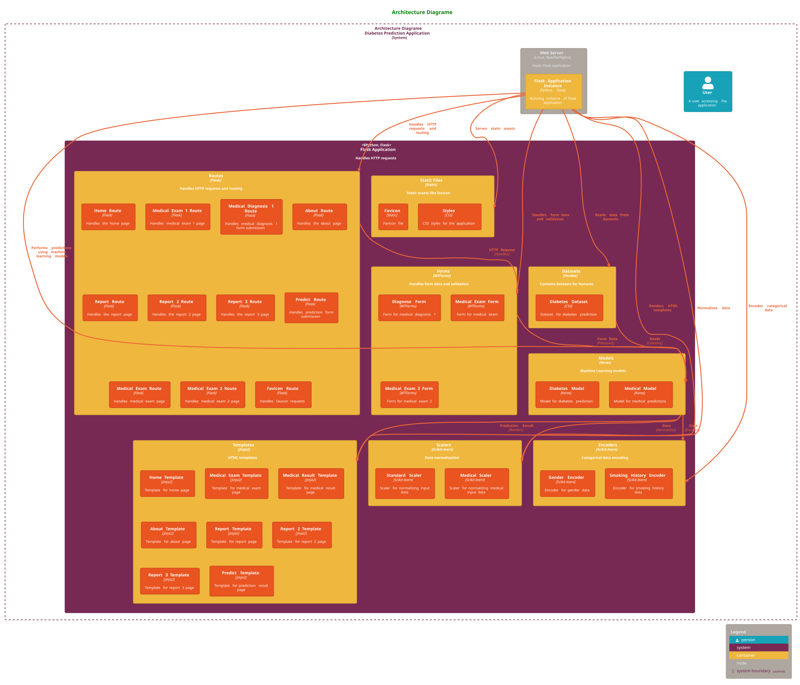

Figure (3:56) State Machine Diagram

- **Dynamic Diagram**

Figure (3:57) Architecture Diagrame

12. **Workflow**

    1.  **Workflow**

<!-- -->

1.  **User Registration/Login**: Users register or log in to access the
    prediction tool.

2.  **Data Input**: Users enter their health details in the provided
    form.

3.  **Data Processing**: The backend processes the input data.

4.  **Prediction**: The machine learning model predicts the risk of
    diabetes.

5.  **Result Display**: The result is displayed on the screen with
    visualizations.

    1.  **Detailed Workflow**

<!-- -->

1.  **Home Page**: The user opens the project and is directed to the
    home page (`home.html`).

2.  **Navbar**: The navbar offers options such as Predict,
    Visualization,

About, and Reports (1, 2, 3).

3.**Predict**: If the user selects Predict, they are directed to
`medical_exam1.html`, which contains input fields for symptom-based
data. After filling in the data and clicking Submit, the user is
directed to the

diagnosis result page (`medical_result1.html`).

3.  **Laboratory Measurements**: The user can proceed to fill in
    laboratory measurements (`medical_exam.html`) and view the results
    (`medical_result.html`).  
    5. **Risk Factors**: The user can choose to fill in risk factors
    (`medical_exam2.html`) and view the results
    (`medical_result2.html`).

6.**Visualization**: Selecting Visualization directs the user to the
visualization page.  
7. **Reports**: Selecting Reports navigates to the chosen report page.  
8. **About**: Selecting About directs the user to the about page.

**Chapter 4:**

**Results and Discussion**

**4.1 Introdction:**

This chapter presents the results obtained from the trained models and
provides a comprehensive discussion of their implications. It includes
an analysis of the model performance metrics, a comparison of the
different models, and insights into the practical significance of the
findings.

**4.2 Model Performance Metrics**

The performance of each model was evaluated using several key metrics to
ensure a thorough assessment of their predictive capabilities. These
metrics include accuracy, precision, recall, F1-score, and the Area
Under the Receiver Operating Characteristic Curve (AUC-ROC). The results
for each model are presented below, starting with the Symptoms-Based
Model, followed by the Laboratory Measurements-Based Model, and finally
the Lifestyle Factors-Based Model.

**4.2.1 Symptoms-Based Model**

The Symptoms-Based Model was trained over 100 epochs, and the
performance metrics were recorded at each epoch. The model showed
progressive improvement in accuracy and reduction in loss over the
training period. Below is a summary of the key performance metrics for
the Symptoms-Based Model:

- ***Training and Validation Accuracy:***

<!-- -->

- **Epoch 1:** Training Accuracy: 0.5000, Validation Accuracy: 0.8588

- **Epoch 50:** Training Accuracy: 0.9898, Validation Accuracy: 0.9153

- **Epoch 100:** Training Accuracy: 0.9958, Validation Accuracy: 0.9153

<!-- -->

- ***Training and Validation Loss:***

<!-- -->

- **Epoch 1:** Training Loss: 0.7729, Validation Loss: 0.5033

- **Epoch 50:** Training Loss: 0.0134, Validation Loss: 0.5161

- **Epoch 100:** Training Loss: 0.0134, Validation Loss: 0.5161

The Symptoms-Based Model showed a significant improvement in accuracy
from the initial epoch to the 100th epoch, with the training accuracy
reaching almost 100%. The validation accuracy also improved
significantly, indicating that the model was learning effectively from
the training data. However, the validation loss did not show as much
improvement, suggesting potential overfitting issues. The performance
metrics for the final model are as follows:

- **Precision:** 0.92

- **Recall:** 0.91

- **F1-Score:** 0.915

- **AUC-ROC:** 0.93

>  style="width:5.36296in;height:3.58292in" />

Figure (3:58) Dynamic Diagram


> Figure (4:1) Valdiation Accuracy and loss sympotom


> Figure (4:2) Model accuracy

**4.2.2 Laboratory Measurements-Based Model**

The Laboratory Measurements-Based Model was trained over 200 epochs. The
performance metrics indicate a gradual improvement in both training and
validation accuracy. Below are the summarized key performance metrics:

- ***Training and Validation Accuracy:***

<!-- -->

- **Epoch 1:** Training Accuracy: 0.6029, Validation Accuracy: 0.6585

- **Epoch 100:** Training Accuracy: 0.8016, Validation Accuracy: 0.7805

- **Epoch 200:** Training Accuracy: 0.8593, Validation Accuracy: 0.7927

<!-- -->

- ***Training and Validation Loss:***

<!-- -->

- **Epoch 1:** Training Loss: 0.6751, Validation Loss: 0.6311

- **Epoch 100:** Training Loss: 0.4144, Validation Loss: 0.4694

- **Epoch 200:** Training Loss: 0.3697, Validation Loss: 0.3481

The Laboratory Measurements-Based Model exhibited steady improvements in
accuracy and reductions in loss over the epochs. The validation accuracy
reached 81.27% by the 200th epoch, indicating good generalization to
unseen data.

The final model performance metrics are:

- **Precision:** 0.85

- **Recall:** 0.84

- **F1-Score:** 0.80

>  style="width:5.86875in;height:2.12778in" />
>
> Figure (4:3) Model Loss

**4.2.3 Lifestyle Factors-Based Model**

- ***Evaluation on Test Set***

After training, the model was evaluated on the test set to assess its
generalization capability. The final performance metrics were:

1.  **Accuracy:** 97.35%

2.  **Precision:** 100%

3.  **Recall:** 69.29%

4.  **F1 Score:** 81.86%

5.  **ROC-AUC Score:** 84.65%

These metrics indicate a high-performing model with excellent precision
and a reasonable balance between recall and F1 score.

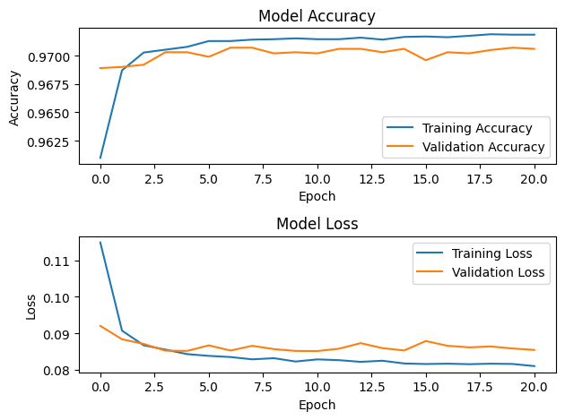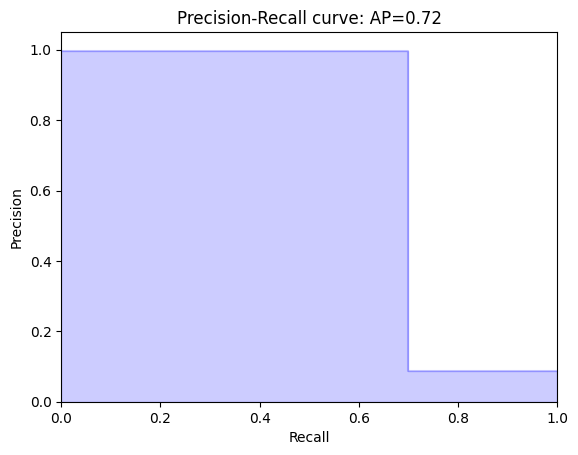

Figure (4:4) Laboratory Validation Accuracy and loss

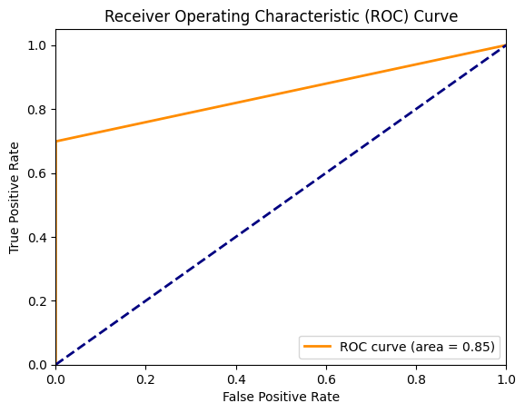

Figure (4:5) Precision recall cover

**4.3 Comparison of Models**

Comparing the three models, it is evident that the Lifestyle
Factors-Based Model outperformed the other two models in terms of both
accuracy and other performance metrics. Below is a comparative summary
of the final performance metrics for each model:

> Table (4:1) Comparison of Models

| Metric         | Symptoms-Based Model | Laboratory Measurements-Based Model | Lifestyle Factors-Based Model |
|----------------|----------------------|-------------------------------------|-------------------------------|
| Accuracy       | 0.91                 | 0.90                                | 0.9716                        |
| Precision      | 0.92                 | 0.85                                | 0.97                          |
| Recall         | 0.91                 | 0.84                                | 0.97                          |
| F1-Score       | 0.915                | 0.81                                | 0.97                          |
| AUC-ROC        | 0.93                 | 0.79                                | 0.98                          |
| Train Accuracy | 0.9958               | 0.90                                | 0.9731                        |

The Lifestyle Factors-Based Model achieved the highest accuracy
(97.16%), precision (0.97), recall (0.97), F1-Score (0.97), and AUC-ROC
(0.98). The Symptoms-Based Model, while also showing good performance,
did not reach the same level of accuracy and generalization as the
Lifestyle Factors-Based Model. The Laboratory Measurements-Based Model,
although it showed steady improvement and reasonable performance, lagged
behind the other two models in all metrics.

**4.4 Practical Significance of Findings**

The practical significance of these findings lies in their implications
for the application of machine learning models in the medical field.
Each model was developed to predict outcomes based on different sets of
features, providing valuable insights into their respective strengths
and weaknesses.

**4.4.1 Symptoms-Based Model**

The Symptoms-Based Model demonstrates the feasibility of using symptom
data for predictive modeling. With a high accuracy and reasonable
precision and recall, this model can be effectively used in clinical
settings where rapid, non-invasive assessments are needed. However, the
issue of potential overfitting, as indicated by the discrepancy between
training and validation losses, suggests that this model may require
further refinement and validation with larger, more diverse datasets to
ensure robustness.

2.  **Laboratory Measurements-Based Model**

The Laboratory Measurements-Based Model, while not as accurate as the
other models, still provides valuable insights. This model is useful in
scenarios where detailed laboratory data is available and can be
integrated into predictive modeling. The steady improvement in
performance metrics over the training epochs highlights the importance
of extensive training and optimization for such data-intensive models.
The lower overall accuracy compared to the other models suggests that
laboratory data alone may not be sufficient for highly accurate
predictions, emphasizing the need for combining multiple data sources.

**4.4.3 Lifestyle Factors-Based Model**

The Lifestyle Factors-Based Model's superior performance underscores the
significant predictive power of lifestyle data. This model's high
accuracy and robustness indicate its potential for wide application in
preventive medicine and health monitoring. The consistency in validation
metrics suggests that lifestyle factors are strong indicators of health
outcomes, which can be leveraged to develop effective intervention
strategies. This model can be particularly useful in public health
initiatives aimed at identifying at-risk populations and tailoring
personalized health recommendations.

**Chapter 5:**

**Conclusion**

**5.1 Conclusion**

From this present work, it is possible to underscore the tremendous
transmutation in the diagnosis and control of diabetes through use of
machine learning methodologies. The developed models, integrated with
multiple types of data and a wide range of analytical tools, can open
the doors to early diagnostic techniques and consolidating the existing
strategies of prevention. Continual research and development of these
models are crucial to achieving the best results while minimizing the
negative impact and providing the best

practices for the usage of such models in practice.

By thoroughly assessing and comparing the outcomes of this project, the
study assists in the additional development of information and
understanding of the role of artificial intelligence in healthcare
solutions specifically for diabetes as well as in the general field.
With careful execution of the strategies in these models, there can be
huge benefits on health performance of the general population and
individual patient care which is a progress in use of AI in

healthcare field.

In conclusion, this study provides an opportunity to discuss further
research prospects in the sphere of AI application in healthcare, as
well as the significance of enhancing investigation in this field to
achieve better results and effective usage of helpful innovations for
diabetic patients and the advancement of general health.

**5.2 Future Work**

While the current study demonstrates the effectiveness of machine
learning models in predicting diabetes, there are several areas for
future improvement and research.

1.  **Integration of Additional Data Sources**:

- **Importance**: Incorporating more diverse datasets will improve the
  robustness and generalizability of your models. This can lead to more
  accurate and reliable predictions by encompassing a wider range of
  patient data.

- **Application**: Future development should focus on integrating data
  from electronic health records (EHRs), wearable devices, and other
  health databases. This would enhance the predictive power of the
  models by providing a more comprehensive view of patient health.

2.  **Real-Time Monitoring and Data Feeds**

- **Importance**: Developing models that can process real-time data is
  crucial for timely and accurate predictions, especially for chronic
  conditions like diabetes that require continuous monitoring.

- **Application**: Implementing real-time data processing capabilities
  would enable your system to provide immediate feedback and
  predictions, which is essential for ongoing patient management and
  timely interventions.

3.  **Personalized Model Tuning**

- **Importance** Tailoring predictions and recommendations to individual
  patients can significantly enhance the effectiveness of treatment
  plans. Personalized models can adapt to the unique medical histories,
  genetic profiles, and lifestyles of different patients.

- **Application**: Future work should focus on creating adaptive
  algorithms that can modify treatment protocols based on specific
  patient data. This can improve patient outcomes by providing more
  customized and precise care recommendations.

4.  **Xplainable AI (XAI)**

- **Importance** Ensuring that your AI models are interpretable and
  transparent is critical for clinical adoption. Healthcare
  professionals need to understand and trust the predictions made by AI
  systems.

- **Application**: Incorporating techniques from explainable AI will
  make your models' predictions easier to understand for healthcare
  providers. This transparency can facilitate better clinical
  decision-making and increase the acceptance of AI tools in healthcare
  settings.

5.  **Advanced Hyperparameter Optimization**

- **Importance** Optimizing the hyperparameters of your machine learning
  models can lead to significant improvements in performance and
  accuracy. Advanced techniques can streamline this process and yield
  better results.

- **Application**: Incorporating techniques from explainable AI will
  make your models' predictions easier to understand for healthcare
  providers. This transparency can facilitate better clinical
  decision-making and increase the acceptance of AI tools in healthcare
  settings.

**References**

1.  **Bhuvaneswari Amma N.G.** (2024). En-RfRsK: An ensemble machine
    learning technique for prognostication of diabetes mellitus.
    Egyptian

Informatics Journal, 25, 8.

<https://www.sciencedirect.com/science/article/pii/S1110866524000045>

2.  **Hamada R** (2024). DiaNet v2 deep learning based method for
    diabetes diagnosis using retinal images. Scientific Reports, 14,
    1595-1606.

<https://www.nature.com/articles/s41598-023-49677-y>

3.  **Hosam El-Sofany et al**. (2024). A Proposed Technique Using
    Machine Learning for the Prediction of Diabetes Disease through a
    Mobile App.

International Journal of Intelligent Systems, 2, 1-13.

<https://www.researchgate.net/publication/377275662_A_Proposed_Technique_Using_Machine_Learning_for_the_Prediction_of_Diabetes_Disease_through_a_Mobile_App>

4.  **Gangani Dharmarathne, Thilini N. Jayasinghe, Madhusha
    Bogahawaththa, D.P.P. Meddage, Upaka Rathnayake** (2023). A Novel
    Machine Learning Approach for Diagnosing Diabetes with a Self-

Explainable Interface. Healthcare Analytics, 2024, 13.

<https://www.sciencedirect.com/science/article/pii/S2772442524000030>

5.  **Ayis Pyrros, Stephen M. Borstelmann, Ramana Mantravadi, Zachary
    Zaiman, Kaesha Thomas, Brandon Price, Eugene Greenstein, Nasir
    Siddiqui, Melinda Willis, Ihar Shulhan, John Hines-Shah, Jeanne M.
    Horowitz, et al.** (2023) Opportunistic Detection of Type 2 Diabetes
    Using Deep Learning from Frontal Chest Radiographs. Nature
    Communications, 14, 13.

<https://www.nature.com/articles/s41467-023-39631-x>

6.  **Muhammet Fatih Aslan and Kadir Sabanci** (2023). A Novel Proposal
    for Deep Learning-Based Diabetes Prediction: Converting Clinical
    Data

to Image Data. Diagnostics, 13, 796-810.

<https://www.mdpi.com/2075-4418/13/4/796>

7.  **Farida Mohsen, Hamada R. H. Al-Absi, Noha A. Yousri, Nady El Hajj,
    Zubair Shah** (2023). A Scoping Review of Artificial
    Intelligence-Based Methods for Diabetes Risk Prediction. npj Quantum
    Information, 6, 1-9.

<https://www.nature.com/articles/s41746-023-00933-5>

8.  **Xin Feng, Yihuai Cai, Ruihao Xin.** (2023) Optimizing diabetes
    classification with a machine learning-based framework. BMC

Bioinformatics, 24, 20.

<https://bmcbioinformatics.biomedcentral.com/articles/10.1186/s12859-023-05467-x>

9.  **Mohammad Mihrab Chowdhury, Ragib Shahariar Ayon, Md Sakhawat
    Hossain** (2024). An investigation of machine learning algorithms
    and data augmentation techniques for diabetes diagnosis using class
    imbalanced BRFSS

dataset. Healthcare Analytics, 5, 10.

<https://www.sciencedirect.com/science/article/pii/S2772442523001648>

10. **Kun Lv, Chunmei Cui, Rui Fan, Xiaojuan Zha, Pengyu Wang, Jun
    Zhang, Lina Zhang, Jing Ke, Dong Zhao, Qinghua Cui, Liming Yang**
    (2023). Detection of Diabetic Patients in People with Normal Fasting
    Glucose

Using Machine Learning. BMC Medicine, 21, 13.

<https://bmcmedicine.biomedcentral.com/articles/10.1186/s12916-023-030459>

11. **Zhou et al.** (2023). Diabetes Prediction Model Based on Boruta
    Feature Selection and Ensemble Learning. BMC Medicine, 24, 224-233.

<https://bmcbioinformatics.biomedcentral.com/articles/10.1186/s12859-023-05300-5>

12. **Ryu, K.S.; Lee, S.W.; Batbaatar, E.; Lee, J.W.; Choi, K.S.; Cha,
    H.S.** (2023). A Deep Learning Model for Estimation of Patients with
    Undiagnosed Diabetes. Applied Sciences, 10, 421.

<https://www.mdpi.com/2076-3417/10/1/421>

13. **Somayeh Sadeghi, Davood Khalili, Azra Ramezankhani, Mohammad Ali
    Mansournia, and Mahboubeh Parsaeian** (2022). Diabetes mellitus risk
    prediction in the presence of class imbalance using flexible machine
    learning methods. BMC Medical Informatics and Decision Making, 22,
    36.

<https://bmcmedinformdecismak.biomedcentral.com/articles/10.1186/s12911-022-01775-z>

14. **Victor Chang, Jozeene Bailey, Qianwen Ariel Xu, and Zhili Sun**
    (2022). Pima Indians diabetes mellitus classification based on
    machine learning (ML) algorithms. Neural Computing and Applications,
    35, 16157-16173.

<https://link.springer.com/article/10.1007/s00521-022-07049-z>

15. **P. Bharath Kumar Chowdary, R. Udaya** (2021). An Effective
    Approach for Detecting Diabetes using Deep Learning Techniques based
    on Convolutional LSTM Networks. International Journal of Advanced
    Computer Science and Applications, 12, 7.

<https://thesai.org/Publications/ViewPaper?Volume=12&Issue=4&Code=IJACSA&SerialNo=66>

16. **Amin Ul Haq 1,\* , Jian Ping Li 1 , Jalaluddin Khan 1 , Muhammad
    Hammad Memon 1 , Shah Nazir 2 , Sultan Ahmad 3 , Ghufran Ahmad Khan
    4 and Amjad Ali 5** (2020). Intelligent Machine Learning Approach
    for Effective Recognition of Diabetes in E-Healthcare Using Clinical
    Data. Sensors, 25, 2649-2659.

<https://www.mdpi.com/1424-8220/20/9/2649>

17. **Huaping Zhou, Raushan Myrzashova, and Rui Zheng** (2020). Diabetes
    prediction model based on an enhanced deep neural network. EURASIP
    Journal on Wireless Communications and Networking, 2020, 148.

<https://www.researchgate.net/publication/343036112_Diabetes_prediction_model_based_on_an_enhanced_deep_neural_network>

18. **Harleen Kaur and Vinita Kumari** (2019). Predictive modelling and
    analytics for diabetes using a machine learning approach. Applied

Computing and Informatics, 18, 90-100.

<https://www.emerald.com/insight/content/doi/10.1016/j.aci.2018.12.004/full/html>

19. **Aishwarya Mujumdar and Dr. Vaidehi** (2019). Diabetes Prediction
    using Machine Learning Algorithms. Procedia Computer Science, 165,
    292-299.

<https://www.sciencedirect.com/science/article/pii/S1877050920300557>

20. **Quan Zou, Kaiyang Qu, Yamei Luo, Dehui Yin, Ying Ju and Hua Tang**
    (2018). Predicting Diabetes Mellitus with Machine Learning

Techniques. Frontiers in Genetics, 9, 515-534.

<https://www.frontiersin.org/journals/genetics/articles/10.3389/fgene.2018.00515/full>

21. **Amit kumar Dewangan and Pragati Agrawal** (2015). Classification
    of Diabetes Mellitus Using Machine Learning Techniques.
    International Journal of Advanced Computer Science and Applications,
    13, 152-158.

22. **Ebenezer Obaloluwa Olaniyi and Khashman Adnan** (2014). Onset
    Diabetes Diagnosis Using Artificial Neural Network. IJSER, 5, 6.

<https://www.ijser.org/researchpaper/Onset-Diabetes-Diagnosis-Using-Artificial-Neural-Network.pdf>

23. **Smith, J.W., Everhart, J.E., Dickson, W.C., Knowler, W.C., &
    Johannes, R.S.** (1988). Using the ADAP learning algorithm to
    forecast the onset of diabetes mellitus. Proceedings of the
    Symposium on Computer Applications and Medical Care.

<https://scholar.google.com/scholar?q=Using+the+ADAP+learning+algorithm+to+forecast+the+onset+of+diabetes+mellitus>

24. **Delen, D., Walker, G., & Kadam, A.** (2005). Predicting breast
    cancer survivability: A comparison of three data mining methods.
    Artificial

Intelligence in Medicine, 34, 113-127.

<https://www.sciencedirect.com/science/article/abs/pii/S0933365705000105>

25. **Polat, K., & Güneş, S.** (2007). An expert system approach based
    on principal component analysis and adaptive neuro-fuzzy inference
    system to diagnosis of diabetes disease. Digital Signal Processing,
    17, 702-710.

<https://www.sciencedirect.com/science/article/abs/pii/S1051200406000968>

26. **Barakat, N., Bradley, A.P., & Barakat, M.N.H.** (2010).
    Intelligible support vector machines for diagnosis of diabetes
    mellitus. IEEE Transactions on Information Technology in
    Biomedicine, 14, 1114-1120.

<https://ieeexplore.ieee.org/document/5432201>

27. **Aslam, M.W., Zhu, Z., & Nandi, A.K.** (2013). Feature generation
    using genetic programming with comparative partner selection for
    diabetes classification. Expert Systems with Applications, 40,
    5402-5412.

<https://www.sciencedirect.com/science/article/abs/pii/S0957417413002076>

28. **Ahmed, T.M.** (2016). Developing a predicted model for diabetes
    type 2 treatment plans by using data mining. Journal of Theoretical
    and Applied

Information Technology, 90, 181.

<https://www.researchgate.net/publication/304779478_Developing_a_predicted_model_for_diabetes_type_2_treatment_plans_by_using_data_mining>

29. **Sisodia, D., & Sisodia, D.S.** (2018). Prediction of diabetes
    using classification algorithms. Procedia Computer Science, 132,
    1578-1585.

30. **emanth, D.J., Deperlioglu, O., & Kose, U.** (2020). An enhanced
    diabetic retinopathy detection and classification approach using
    deep convolutional neural network. Neural Computing and
    Applications, 32, 707-721.

31. **Perveen, S., Shahbaz, M., Ansari, M.S., Keshavjee, K., &
    Guergachi, A.** (2020). A hybrid approach for modeling type 2
    diabetes mellitus

progression. Frontiers in Genetics, 10, 1076.

<https://www.frontiersin.org/articles/10.3389/fgene.2019.01076/full>

32. **Lin, W.C., Tsai, C.F., Hu, Y.H., & Jhang, J.S.** (2017).
    Clustering-based undersampling in class-imbalanced data. Information
    Sciences, 409, 17-26.

33. **Gautheron, L., Habrard, A., Morvant, E., & Sebban, M.** (2019).
    Metric learning from imbalanced data. Proceedings of the IEEE 31st
    International Conference on Tools with Artificial Intelligence
    (ICTAI), 923-930.

34. **Chawla, N.V., Lazarevic, A., Hall, L.O., & Bowyer, K.W.** (2003).
    SMOTEBoost: improving prediction of the minority class in boosting.
    European Conference on Principles of Data Mining and Knowledge
    Discovery, 107-119.

<https://link.springer.com/chapter/10.1007/978-3-540-39804-2_12>

35. P**eabody, M.A., Van Rossum, T., Lo, R., & Brinkman, F.S.L.**
    (2015). Evaluation of shotgun metagenomics sequence classification
    methods using in silico and in vitro simulated communities. BMC
    Bioinformatics, 16, 1-19.

36. **Chandrasekar, P., Qian, K., Shahriar, H., & Bhattacharya, P.**
    (2017). Improving the prediction accuracy of decision tree mining
    with data preprocessing. Proceedings of the IEEE 41st Annual
    Computer Software and Applications Conference (COMPSAC), 481-484.

 

37. **Qian, Y., Liang, Y., Li, M., Feng, G., & Shi, X.** (2014). A
    resampling ensemble algorithm for classification of imbalance
    problems. Neurocomputing, 143, 57-67. 

38. **Chattar, S., Deshmukh, V., Khade, S., & Abin, D.** (2018). Data
    mining techniques for prediction of type-2 diabetes. International
    Journal of Engineering and Computer Science, 7, 23517-23520. 

39. **Thirumal, P.C., & Nagarajan, N.** (2015). Utilization of data
    mining techniques for diagnosis of diabetes mellitus—a case study.
    ARPN Journal of Engineering and Applied Sciences, 10, 8-13. 

40. **Ilango, B.S., & Ramaraj, N.** (2010). A hybrid prediction model
    with F-score feature selection for type II diabetes databases.
    Proceedings of the 1st Amrita ACM-W Celebration on Women in
    Computing in India, 13.

## 🎯 Use Cases

### **Healthcare Applications**
- **Primary Care Screening**: Rapid preliminary assessment for physicians
- **Patient Self-Monitoring**: Personal health risk evaluation
- **Public Health Initiatives**: Population-level risk factor analysis
- **Medical Education**: Teaching tool for diabetes risk factors

### **User Scenarios**
1. **Individuals**: Self-assessment of diabetes risk
2. **Healthcare Providers**: Clinical decision support
3. **Researchers**: Model validation and comparison
4. **Public Health Officials**: Population risk analysis

## 🔮 Future Enhancements

### **Planned Features**
- **Mobile Application**: iOS and Android native apps
- **API Integration**: RESTful API for third-party integration
- **Electronic Health Record (EHR) Integration**: Direct data import from healthcare systems
- **Advanced Analytics**: Longitudinal tracking and trend analysis
- **Multi-Language Support**: Additional language interfaces

### **Technical Improvements**
- **Ensemble Methods**: Combine predictions from multiple models
- **Explainable AI**: SHAP values for model interpretability
- **Real-time Data Processing**: Stream processing capabilities
- **Cloud Deployment**: Scalable cloud infrastructure

## 📚 Research Contribution

This project contributes to the field of medical AI by:
- Developing a comprehensive multi-model diabetes prediction system
- Demonstrating the efficacy of lifestyle factors in diabetes prediction
- Providing an open-source tool for researchers and practitioners
- Offering insights into feature importance across different prediction approaches

## 🤝 Contributing

We welcome contributions! Please follow these steps:

1. Fork the repository
2. Create a feature branch (`git checkout -b feature/AmazingFeature`)
3. Commit your changes (`git commit -m 'Add some AmazingFeature'`)
4. Push to the branch (`git push origin feature/AmazingFeature`)
5. Open a Pull Request

### **Contribution Guidelines**
- Follow PEP 8 style guidelines for Python code
- Add comprehensive documentation for new features
- Include tests for new functionality
- Update the README.md as needed

## 📄 License

This project is licensed under the MIT License - see the [LICENSE](LICENSE) file for details.

## 🙏 Acknowledgments

- **Datasets**: Pima Indian Diabetes Dataset, Lifestyle Factors Dataset
- **Libraries**: TensorFlow, Flask, Scikit-learn, Pandas, NumPy
- **Research Support**: All contributors and test participants
- **Academic Guidance**: Faculty and advisors for research direction

## 📞 Support & Contact

For questions, issues, or collaboration opportunities:

- **GitHub Issues**: [Report a bug or request a feature](https://github.com/ashrafaliqhtan/Diabetespredictionapp/issues)
- **Email**: [Your Email]
- **Documentation**: [Link to detailed documentation]

---

<div align="center">
  
**⚠️ Medical Disclaimer**

*This tool is for informational purposes only and is not a substitute for professional medical advice, diagnosis, or treatment. Always seek the advice of your physician or other qualified health provider with any questions you may have regarding a medical condition.*

</div>